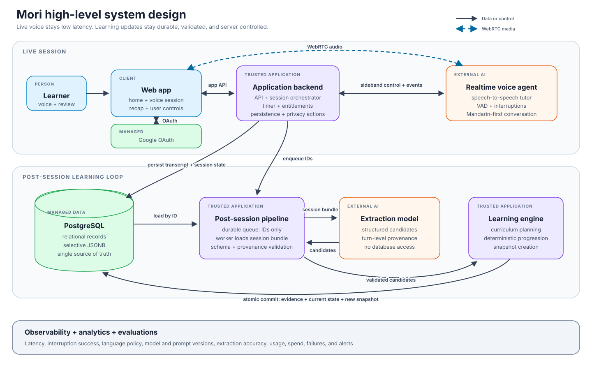

# Mori high-level system design

**Status:** Approved baseline

**Date:** September 1, 2026

**Related document:** [Product requirements document](PRD.md)

## 1. Purpose

This document defines the highest-level component boundaries and user flow for the Mori MVP. It is intentionally limited to the major pieces. Detailed service, data, sequence, deployment, and failure-mode diagrams will follow.

The design separates two workloads:

- A low-latency live voice path for the learner's conversation.
- A durable post-session path that extracts evidence and updates learning state safely.

## 2. Architecture



The initial system consists of one responsive web application, one trusted application backend, a managed authentication provider, a Realtime voice agent, PostgreSQL, a durable job queue and worker, a structured extraction model, and a deterministic learning engine.

PostgreSQL is the system of record. A separate NoSQL database is not required for the MVP because the important unstructured learning data still has relational access, provenance, consistency, export, and deletion requirements. JSONB is used selectively where the application reads and versions a compact document as one unit.

## 3. End-to-end user flow

1. **Sign in and onboard**
   - The learner signs in through Google OAuth.
   - The web app creates or loads the user, language profile, preferences, plan, and effective entitlements through the backend.
   - A new account receives one non-resetting introductory voice-session entitlement.

2. **Authorize and plan a session**
   - The backend atomically reserves an available voice session before creating provider credentials.
   - The free introductory entitlement permits one session of up to 20 minutes.
   - At launch, Basic permits two sessions of up to 20 minutes per weekly entitlement window.
   - The learning engine selects one to three objectives from the latest committed learner snapshot, due reviews, curriculum gates, and recent evidence.
   - The backend persists the versioned session plan.

3. **Start the live conversation**
   - The browser exchanges audio with the Realtime voice agent over WebRTC.
   - The trusted backend maintains a sideband control connection for prompt configuration, events, transcript ingestion, server-authoritative timing, and forced termination.
   - Standard provider API credentials never reach the browser.

4. **Persist the session**
   - The backend stores ordered learner and tutor turns as they arrive.
   - At early ending, disconnection, or the 20-minute limit, it finalizes the session with the authoritative end reason and connected duration.
   - A session with at least one usable learner turn consumes its reservation. A setup failure with no usable turn releases it.

5. **Dispatch durable post-session analysis**
   - The completed transcript, session plan, end metadata, and prior snapshot reference are durable before analysis begins.
   - The queue carries identifiers such as `session_id`, `analysis_run_id`, and `analyzer_version`, not the transcript itself.
   - A worker loads the exact versioned session bundle from PostgreSQL for every attempt.

6. **Extract and validate learning evidence**
   - The worker sends the bounded session bundle to a structured extraction model.
   - The model returns schema-constrained candidates with turn-level provenance and confidence.
   - Deterministic application rules reject unsupported evidence, validate progression requirements, and compute the next state.

7. **Commit progress and show the recap**
   - One database transaction appends evidence, updates normalized current state, creates an immutable planning snapshot, and marks the analysis run complete.
   - The web app reads the recap and latest committed progress.
   - Failed analysis retries from the same durable inputs and never duplicates committed evidence.

## 4. Major components

| Component | Responsibilities | Does not own |
| --- | --- | --- |
| Web app | Onboarding, plan and usage display, microphone UX, WebRTC session, recap, privacy controls | Provider secrets, entitlement authority, learning progression |
| Google OAuth | Managed user authentication and stable external identity | Application authorization or plan limits |
| Application backend and session orchestrator | Application API, effective-entitlement resolution, atomic usage reservation, provider session creation, sideband control, transcript ingestion, timer, persistence, privacy actions | Generative conversation or unvalidated learning decisions |
| Realtime voice agent | Low-latency speech-to-speech Mandarin tutoring, turn detection, interruptions | Durable user state, plan enforcement, authoritative timing, progression commits |
| PostgreSQL | Users, plans, entitlements, sessions, turns, curriculum, evidence, current state, memories, analysis runs, snapshots, and usage ledger | Raw audio by default |
| Durable queue and analysis worker | Reliable analysis dispatch, retries, loading exact inputs, extraction orchestration, schema and provenance validation | Authoritative source records inside queue messages |
| Extraction model | Structured transcript observations with source-turn references and confidence | Database access, final progression, direct state mutation |
| Learning engine | Curriculum selection, deterministic state transitions, level rules, planning-snapshot creation | Live conversational wording |
| Observability and evaluation | Latency, errors, interruption quality, language-policy adherence, extraction quality, usage, cost, and alerts | Product state of record |

## 5. Storage model

### 5.1 PostgreSQL as the system of record

Use normalized relational records for data that is updated, queried independently, constrained, or audited:

- Users, identities, subscriptions, entitlement grants, and usage events.
- Sessions, versioned plans, and one ordered row per transcript turn.
- Published curriculum versions and curriculum items.
- Learning evidence with exact source-turn references.
- Current learner-item state and level assessments.
- Conversation memories and their retention metadata.
- Analysis attempts and idempotency keys.

This provides one transactional boundary for entitlement consumption, session finalization, learning-state commits, export, and deletion.

### 5.2 Selective JSONB

Use versioned JSONB for compact documents that are normally read as a whole:

- Immutable per-session planning snapshots.
- Provider-specific event metadata that is not part of the stable transcript schema.
- Versioned bounded model inputs or outputs when retained for audit and replay.

Normalized evidence and current learner state remain the source of truth. A planning snapshot is a read model for planning, audit, and replay, not a replacement for those records.

### 5.3 Future object storage

Raw audio is not retained by default. If opt-in audio retention is introduced, binary media belongs in encrypted object storage with ownership, retention, and deletion metadata in PostgreSQL.

## 6. Durable analysis handoff

The reliable boundary between the live session and asynchronous learning update is:

```text
Backend transaction
  -> finalize session bundle
  -> create analysis run or transactional outbox record

Durable queue
  -> send identifiers only

Analysis worker
  -> load exact bundle from PostgreSQL
  -> call structured extraction
  -> validate candidates with deterministic rules

Commit transaction
  -> append evidence
  -> update current state
  -> create immutable planning snapshot
  -> complete analysis run
```

The queue is a durable wake-up signal, not a cache or transcript transport. Processing is idempotent by session, analysis run, analyzer version, and rule version.

## 7. Trust and correctness boundaries

1. **Models propose.** Voice and extraction models produce conversation or structured candidates within bounded context.
2. **Rules commit.** Deterministic application code validates evidence, progression, levels, and entitlement usage.
3. **The server is authoritative.** The backend owns credentials, session time, persisted events, feature access, usage, privacy actions, and final learning-state transactions.

No model receives unrestricted database access or directly mutates durable learner state.

## 8. Scaling path

- Keep the application backend stateless outside durable stores so instances can scale horizontally.
- Keep the browser-to-voice-agent media path direct through WebRTC so application servers do not relay audio.
- Scale post-session workers independently from live-session traffic.
- Partition queue work by session ID and use idempotent consumers.
- Add PostgreSQL read replicas, table partitioning, or archival only when measured access patterns require them.
- Add a separate search or analytics store only after a distinct query workload appears. PostgreSQL remains authoritative.

## 9. Decisions captured in this baseline

- Use Google OAuth for the simplest initial managed sign-in path.
- Use PostgreSQL for both normalized product state and selective versioned JSONB.
- Store transcript turns relationally rather than as one document blob.
- Keep learning evidence and current state normalized.
- Create one immutable planning snapshot after each committed session analysis.
- Send identifiers through the queue and load analysis inputs from durable storage.
- Give each new account one free introductory session of up to 20 minutes.
- Give Basic users two sessions of up to 20 minutes per weekly entitlement window.
- Define plan capabilities through versioned entitlements so future plans can vary features and usage limits.
- Allow cost-optimized Basic extraction only when it meets the same required correctness and provenance thresholds.
- Serve only published curriculum versions in new session plans.

## 10. Open design decisions

- The complete session lifecycle, reconnect grace period, and partial-session analysis rules.
- The weekly entitlement boundary and timezone-change behavior.
- Whether an unused introductory session expires.
- Transcript and memory retention defaults before public launch.
- Whether initial manual snapshot review blocks the next session or runs retrospectively.
- Which future plans and feature entitlements follow Basic.

These questions do not change the high-level component boundaries, but they affect detailed state-machine, schema, and sequence diagrams.
