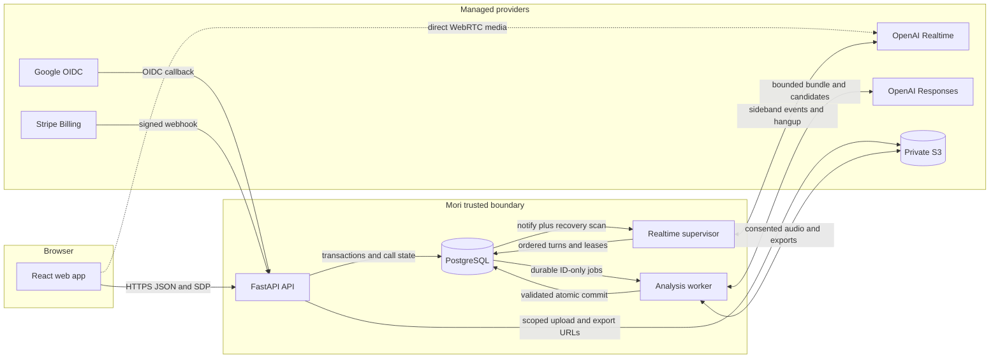

# Mori backend architecture

**Status:** Approved implementation baseline

**Recorded:** September 2, 2026

This documentation turns the backend architecture proposal into a durable implementation reference. The backend is a Python modular monolith with three independently scaled process types, one PostgreSQL source of truth, and explicit adapters around every external provider.

The product requirements remain authoritative for user behavior and product policy. These documents define how the system preserves those requirements under concurrency, retries, provider failures, and process restarts.

## Architecture at a glance

| Concern | Baseline |
| --- | --- |
| Application shape | One Python modular monolith and one versioned backend image |
| Runtime processes | `mori-api`, `mori-realtime-supervisor`, and `mori-analysis-worker` |
| Source of truth | PostgreSQL for application state, ledgers, transcripts, evidence, snapshots, and durable jobs |
| Browser contract | Versioned REST and SDP endpoints described by OpenAPI, with a generated TypeScript client and Zod validators |
| Live media | Browser-to-OpenAI WebRTC after a server-controlled SDP exchange |
| Live control | Dedicated supervisor using the OpenAI sideband connection, persisted leases, and a server deadline |
| Post-session work | PostgreSQL-backed Procrastinate jobs containing stable identifiers only |
| Consented files | Private S3 objects encrypted with SSE-KMS |
| Production baseline | AWS ECS Fargate, RDS PostgreSQL, S3, KMS, Secrets Manager, CloudFront, ALB, WAF, and Terraform |

## Implementation status

The architecture is approved, but the backend is not implemented. The repository currently has a useful frontend seam:

- React features read through `WebAppGateway` instead of scattered network calls.
- A mock gateway supplies dashboard, recap, and memory view models.
- `RealtimeSessionFactory` isolates the future WebRTC implementation.
- Authentication, backend mutations, production transport, microphone capture, and realtime provider integration are not present yet.

The first real vertical slice will sign in a learner, provision one language profile and intro grant, reserve that grant, persist a session plan, exchange SDP, supervise one usable turn, finalize the session, enqueue analysis atomically, and expose the resulting recap.

## System context



Only two hosts are public:

- `mori` serves immutable React assets through CloudFront from a private S3 origin.
- `api.mori` routes through Route 53, ACM TLS, AWS WAF, and an Application Load Balancer to `mori-api`.

The supervisor and worker have no public application endpoints. API and webhook responses are explicitly non-cacheable. The browser never receives a standard provider API key.

## Architectural goals

- Keep realtime media off the application data path while retaining server control of session duration and lifecycle.
- Make entitlements, session transitions, turn ingestion, analysis, and progression correct under retries and concurrent requests.
- Commit post-session learning state atomically from validated, turn-level provenance.
- Keep provider-specific behavior behind replaceable ports.
- Make privacy, consent, retention, deletion, review, and repair auditable system behavior.
- Scale HTTP traffic, active calls, and background work independently without creating a distributed microservice system.

## Non-goals

- Independently versioned backend microservices or a private HTTP mesh.
- Provider-owned authorization, plan semantics, curriculum progression, or learner state.
- Long-running realtime connections or post-session analysis inside API request handlers.
- Generic JSON blobs for lifecycle facts that require constraints or auditing.
- Raw audio retention without explicit, per-session consent.

## System invariants

These rules apply across every module and runtime:

1. PostgreSQL is authoritative. Notifications are wake-up hints, never the durable record.
2. Network calls do not run inside transactions that hold entitlement or learner-state locks.
3. Every externally retried mutation has an idempotency key or provider event identifier.
4. Session transitions use compare-and-set updates and reject invalid prior states.
5. Jobs contain identifiers and version pins, not transcripts, audio, or mutable learner state.
6. Model output is a candidate. Schema, provenance, confidence, policy, and curriculum rules are validated before commit.
7. Evidence and historical decisions are append-only. Corrections create new decisions and snapshots.
8. The server owns connected-time accounting and the 20-minute deadline.
9. No consent, expired consent, incomplete audio, or failed capture means insufficient pronunciation evidence, not session failure.
10. Deletion revokes access first, completes durable deletion work, then rebuilds affected derived learner state.

## Deployable shape

The three runtime processes are operational services from the same codebase. They import the same application modules, use the same database schema, and ship from the same backend image.

| Process | Entry point | Primary responsibility |
| --- | --- | --- |
| API | `uv run uvicorn mori.api.main:create_app --factory` | Authentication, HTTP contracts, synchronous use cases, SDP exchange, webhooks, and transaction boundaries |
| Realtime supervisor | `uv run python -m mori.runtime.supervisor` | Sideband connections, ordered turn persistence, leases, connected-time enforcement, and call finalization |
| Analysis worker | `uv run python -m mori.runtime.worker` | Extraction, deterministic learning updates, recaps, retention, export, deletion, and repair jobs |

`uv run alembic upgrade head` is a pre-deploy task, not a fourth service. Runtime processes start only after the single migration task succeeds. Applications never migrate the production database during boot.

## Intended repository structure

```text
apps/
  backend/
    pyproject.toml
    src/mori/
      api/                 # FastAPI factory, middleware, and route adapters
      runtime/             # Supervisor and worker entry points
      modules/
        identity/
        access/
        curriculum/
        sessions/
        realtime/
        learning/
        privacy/
      adapters/            # OpenAI, Google, Stripe, PostgreSQL, and object storage
      contracts/           # Shared event envelopes and OpenAPI inputs
      settings.py
    migrations/            # One ordered Alembic history
    tests/                 # Unit, integration, contract, and architecture tests
  web/                     # Existing React application
packages/
  api-client/              # Generated TypeScript client and Zod validators
infra/
  terraform/               # Staging and production AWS infrastructure
docs/
  architecture/
  plans/
```

Each business module should begin with `domain.py`, `service.py`, `repository.py`, and `models.py` only where those files have a clear responsibility. Add subpackages when behavior requires them, not to satisfy a template.

## Documentation map

- [Runtime services and flows](runtime-services.md) defines process ownership, state machines, failure recovery, and transaction boundaries.
- [Modules and data](modules-and-data.md) defines logical boundaries, command and query interfaces, record ownership, and data invariants.
- [API and security](api-and-security.md) defines public entry points, the first API surface, authentication, provider boundaries, and consented audio.
- [Architecture decisions](decisions.md) records selected alternatives, consequences, and remaining owner decisions.
- [Architecture references](references.md) preserves product sources and official integration documentation.
- [Backend implementation plan](../plans/backend-implementation.md) sequences delivery and defines milestone exit gates.
- [Product requirements](../PRD.md) remains authoritative for MVP behavior and acceptance criteria.
- [High-level system design](../diagrams/high-level-system-design.md) remains the concise product-level diagram.

## Change policy

Architecture changes should update the narrowest owning document and add or amend a decision in [Architecture decisions](decisions.md) when they change a system boundary, source of truth, trust boundary, provider, or cross-module invariant. Product-policy changes must first be reconciled with the PRD.
