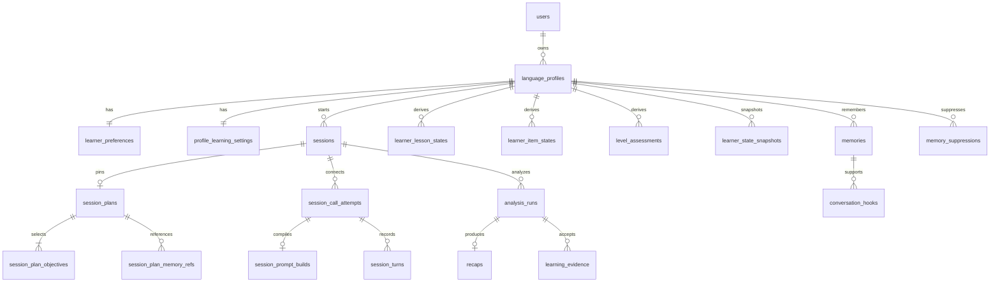

# Learning system data contracts

**Status:** Shared-lesson replacement design; lesson fields and records are not yet implemented

**Date:** September 26, 2026. Lesson progression revised October 5, 2026.

This is the object structure for the learning-system records and public read models. Field names below use API-style camelCase; SQL columns use snake_case. `UUID` means a PostgreSQL UUID and `Instant` means `timestamptz`. Optional fields are marked `?`. Every owned record is scoped through its parent profile or session, and the application checks the authenticated user before reading or writing it.

## 1. Relationship map



Existing `users`, `language_profiles`, `learner_preferences`, `sessions`, `session_plans`, and `session_plan_objectives` are extended. The other records are new. The shared lesson profile and pair-specific course definitions are versioned Python code, outside the relational model. A language profile belongs to exactly one base/target pair; a learning session pins one lesson-profile version and one pair-course version. Profile changes never transfer evidence or memories to another pair.

## 2. Shared values and ownership

```ts
type UUID = string; // canonical UUID in API JSON
type Instant = string; // RFC 3339 timestamp in API JSON
type Level = "beginner" | "intermediate" | "advanced" | "fluent";
type StartingChoice = Level | "unsure";
type Mode = "learning" | "practice";
type AssessedLevel = "beginner" | "intermediate" | "advanced";
type ObjectiveKind = "graded" | "conversation_focus";
type AnalysisStatus = "pending" | "running" | "succeeded" | "failed";
type RecapStatus = "processing" | "ready" | "failed";
type SessionState = "created" | "reserved" | "planned" | "connecting" | "active"
  | "reconnecting" | "ending" | "analysis_pending" | "ready" | "analysis_failed"
  | "setup_failed";
```

`fluent` is a practice-mode choice, never an assessed `AssessedLevel`. First-session `unsure` starts provisional Beginner learning mode. `version` integers are optimistic-concurrency tokens; policy and curriculum version strings name immutable published artifacts. Content and model output are bounded and schema validated before persistence. A source turn ID is a stable server-owned turn ID, not a provider event ID supplied by the model.

The existing `users` table adds `version: number` for account-level `If-Match` when selecting the active profile. It advances when onboarding completion or active-profile selection changes. `onboardingCompletedAt` stays nullable until an explicitly confirmed pair and starting mode exist.

## 3. Profile and published course

```ts
type LanguageProfile = { // existing table: language_profiles
  id: UUID; userId: UUID; baseLanguageId: string; targetLanguageId: string;
  status: "active" | "archived"; languageSelectionConfirmedAt?: Instant;
  version: number; createdAt: Instant;
};

type LearnerPreferences = { // existing table: learner_preferences
  languageProfileId: UUID; correctionPreference: "light" | "balanced" | "frequent";
  tutorPace: "level" | "gentle" | "steady" | "natural";
  captionsEnabled: boolean; timezone: string; interests: string[];
  version: number; updatedAt: Instant;
};

type ProfileLearningSettings = { // new table: profile_learning_settings
  languageProfileId: UUID; startingChoice: StartingChoice;
  provisionalLevel?: AssessedLevel; mode: Mode;
  version: number; createdAt: Instant; updatedAt: Instant;
};

type LessonProfile = { // shared, versioned Python source
  version: string; lessons: LessonDefinition[];
};

type CourseDefinition = { // pair-specific versioned Python source
  baseLanguageId: string; targetLanguageId: string;
  curriculumVersion: string; pairPolicyVersion: string; voicePolicyVersion: string;
  lessonProfileVersion: string;
  pairPolicy: string; voicePolicy: string;
  items: CurriculumItem[];
};

type LessonDefinition = { // immutable within one shared lesson-profile version
  key: string; level: AssessedLevel; ordinal: number; learnerTitle: string;
  guidanceVersion: string; conversationGuidance: string;
  capability: string; evidenceCriteria: string;
  primaryItemKey: string; prerequisiteLessonKeys: string[];
  suggestedScenarios: string[]; optionalPhraseIntents: string[];
};

type CurriculumItem = { // versioned Python source
  key: string; kind: "vocabulary" | "grammar" | "conversation" | "pronunciation";
  purpose: "diagnostic" | "skill";
  level: AssessedLevel; learnerLabel: string; targetLanguageContent: string;
  selectionWeight: number; topicTags: string[]; wordTags: string[];
  prerequisiteKeys: string[]; enabled: boolean;
};

type EvidenceRule = { // versioned Python source
  ruleVersion: string; evidenceKind: "use" | "comprehension" | "repair";
  minimumDistinctTurns: number; confidenceThreshold: number;
  masteryThreshold: number; requirement: string; enabled: boolean;
};
```

`users.onboardingCompletedAt` is nullable until an owned profile has an explicitly confirmed published pair and starting mode. The existing unique `(userId, baseLanguageId, targetLanguageId)` and one-active-profile partial unique index remain. `language_profiles.version` and `profile_learning_settings.version` advance on their own edits. Interests are normalized, deduplicated, length limited, and never treated as learning evidence. A pair is selectable only when a complete pair course and its referenced shared lesson-profile version are published. The initial lesson profile has ten ordered Beginner lessons and seven ordered Intermediate lessons, with a smaller Advanced sequence. Lesson keys and `(level, ordinal)` pairs are unique within a lesson-profile version; prerequisites point to earlier lessons in the same level or an approved placement path and contain no cycles. Each pair course referencing that profile provides matching curriculum items for every lesson's primary item key, plus target-language content and pair policy. Curriculum item keys are unique within a pair-course version, prerequisites cannot point outside it or form cycles, and published versions remain available when new versions are added. Pronunciation items may be presented live, but their evidence rules remain disabled for progression until an approved audio evaluator exists.

The current published pair course defines a diagnostic and starter conversation items at each learning level. It does not yet reference a lesson profile. Publish one immutable shared lesson profile with the complete ordered sequence and evidence criteria, then publish a new compatible version of each supported pair course before lesson-aware plans are enabled for that pair. The first Beginner lesson assumes the learner can say their name and origin; it expands into basic life context. Lesson guidance describes conversational movement, not a fixed sequence of questions. Existing evidence rules are disabled while numeric progression and evaluation thresholds await approval. Publication and planning do not imply that those rules can promote lesson completion or mastery.

## 4. Session setup and Realtime records

```ts
type Session = { // existing table: sessions
  id: UUID; userId: UUID; languageProfileId: UUID;
  creationKeyDigest: string; setupRequestDigest: string;
  state: SessionState; rowVersion: number; connectedLimitMs: number;
  connectedMs: number; sessionExpiresAt?: Instant;
  endReason?: string; finalTurnSequence?: number;
  createdAt: Instant; updatedAt: Instant;
};

type SessionPlan = { // existing table: session_plans
  sessionId: UUID; schemaVersion: "learning_plan_v1"; mode: Mode;
  sourceSnapshotId?: UUID;
  profileVersion: number; preferenceVersion: number; settingsVersion: number;
  curriculumVersion: string; lessonProfileVersion: string;
  selectionRuleVersion: string;
  basePolicyVersion: string; pairPolicyVersion: string; levelBlockVersion: string;
  selectedLevel?: AssessedLevel; topic?: string; requestedWords: string[];
  lessonKey?: string; lessonGuidanceVersion?: string;
  lessonEncounterKind?: "first" | "continuation" | "review";
  setupRequestDigest: string; objectiveCount: 1 | 2 | 3; createdAt: Instant;
};

type PlanObjective = { // existing table: session_plan_objectives
  sessionId: UUID; ordinal: 1 | 2 | 3; kind: ObjectiveKind;
  curriculumItemKey?: string; learnerLabel: string;
};

type SessionPlanMemoryRef = { // new table: session_plan_memory_refs
  sessionId: UUID; memoryId: UUID; selectedAt: Instant;
};

type CallAttempt = { // new table: session_call_attempts
  id: UUID; sessionId: UUID; attemptNumber: number;
  providerCallId?: string; status: "creating" | "active" | "ended" | "failed";
  startedAt: Instant; endedAt?: Instant;
};

type PromptBuild = { // new table: session_prompt_builds
  callAttemptId: UUID; sessionId: UUID;
  basePolicyVersion: string; pairPolicyVersion: string; levelBlockVersion: string;
  lessonProfileVersion?: string; lessonGuidanceVersion?: string;
  modelAlias: string; voiceConfigVersion: string;
  selectedMemoryIds: UUID[]; instructionsSha256: string; createdAt: Instant;
};

type SessionTurn = { // new table: session_turns
  id: UUID; sessionId: UUID; callAttemptId: UUID; sequence: number;
  speaker: "learner" | "tutor"; finalText: string;
  providerEventId: string; startedAt?: Instant; endedAt?: Instant;
  quality: "usable" | "unclear" | "partial";
};
```

`SessionState` remains the existing database state union. `setupRequestDigest` binds idempotency to topic, requested words, and profile ID. A plan is written once for a session and is never silently edited after creation. An active learning plan requires exactly one lesson key from its pinned shared lesson profile, matching the selected level and guidance version, and at least one graded objective tied to a matching item in the pinned pair course. A practice plan has no lesson key, guidance version, or encounter kind. A graded objective requires a key from the pinned pair-course version; a conversation focus has no item. A memory reference is eligibility only, never a copy of text. The prompt build is one per call attempt; its selected IDs are an audit manifest, while the compiler filters currently revoked or expired memories before every provider bootstrap. Reconnect creates a new call attempt and prompt build under the same plan. `session_turns` is unique by `(sessionId, sequence)` and by `(callAttemptId, providerEventId)` to deduplicate provider replay. Only finalized turns at or below `finalTurnSequence` enter analysis. Do not store raw instructions, audio, or memory text in general logs.

The `SessionPlan` type above is the single active plan shape after replacement. At cutover, drain active objective-only calls, then reclassify their existing `learning_plan_v1` rows as `legacy_objective_only` for history reads. Expire unstarted objective-only sessions and release their reservations. A one-time migration adds the lesson columns and permits the legacy discriminator for read-only rows. Existing `legacy_placeholder` rows also remain history only. New lesson plans continue using the existing `learning_plan_v1` discriminator. The prompt compiler accepts only active lesson-complete learning plans or practice plans; it has no objective-only compilation path. The existing objective `text` column remains the source for `learnerLabel` until a later migration renames it.

## 5. Analysis, derived learning state, and recap

```ts
type AnalysisRun = { // new table: analysis_runs
  id: UUID; sessionId: UUID; analysisPolicyVersion: string;
  extractionSchemaVersion: string; extractionModelAlias: string;
  curriculumVersion: string; evidenceRuleVersion: string;
  mode: Mode; finalTurnSequence: number; status: AnalysisStatus;
  startedAt?: Instant; completedAt?: Instant; failureCode?: string;
};

type LearningEvidence = { // new table: learning_evidence
  id: UUID; analysisRunId: UUID; sessionId: UUID; languageProfileId: UUID;
  curriculumItemKey: string; kind: "use" | "comprehension" | "repair";
  sourceTurnIds: UUID[]; confidence: number; acceptedAt: Instant;
};

type LearnerLessonState = { // new table: learner_lesson_states, append-only decisions
  id: UUID; languageProfileId: UUID; curriculumVersion: string;
  lessonProfileVersion: string;
  lessonKey: string; sourceAnalysisRunId: UUID;
  outcome: "demonstrated" | "needs_practice" | "insufficient_evidence";
  sourceTurnIds: UUID[]; decidedAt: Instant;
};

type LearnerItemState = { // new table: learner_item_states, append-only decisions
  id: UUID; languageProfileId: UUID; curriculumItemKey: string;
  sourceAnalysisRunId: UUID; state: "new" | "practicing" | "review_due" | "mastered";
  evidenceCount: number; nextReviewAt?: Instant; decidedAt: Instant;
};

type LevelAssessment = { // new table: level_assessments, append-only decisions
  id: UUID; languageProfileId: UUID; sourceAnalysisRunId: UUID;
  assessedLevel: AssessedLevel; confidence: number;
  rationaleTurnIds: UUID[]; ruleVersion: string; decidedAt: Instant;
};

type LearnerStateSnapshot = { // new table: learner_state_snapshots
  id: UUID; languageProfileId: UUID; sourceAnalysisRunId: UUID;
  curriculumVersion: string; lessonProfileVersion: string;
  selectorStateSchemaVersion: string;
  assessedLevel?: AssessedLevel; levelConfidence?: number;
  lessonStateIds: UUID[]; itemStateIds: UUID[];
  dueLessonKeys: string[]; dueItemKeys: string[]; repairItemKeys: string[];
  createdAt: Instant;
};

type Recap = { // new table: recaps
  id: UUID; sessionId: UUID; analysisRunId: UUID; mode: Mode;
  status: RecapStatus; summary: string;
  learningDetails?: { schemaVersion: string; lessonOutcome: LessonOutcome;
    objectiveOutcomes: ObjectiveOutcome[];
    corrections: CorrectionExample[]; nextFocus?: string; levelChangeReason?: string };
  permittedMemoryIds: UUID[]; createdAt: Instant;
};

type LessonOutcome = { lessonKey: string; result: "demonstrated" | "needs_practice" | "insufficient_evidence"; sourceTurnIds: UUID[] };
type ObjectiveOutcome = { objectiveOrdinal: number; result: "practiced" | "supported" | "needs_retry"; sourceTurnIds: UUID[] };
type CorrectionExample = { learnerTurnId: UUID; conciseSuggestion: string };
```

The worker treats extraction as candidate data. It validates exact turn IDs, ownership, curriculum version, confidence, consent, and deletion state before writing evidence. A lesson decision is tied to the pinned lesson and evidence criteria. `demonstrated` requires independent use across varied relevant opportunities; immediate repetition of a model phrase is insufficient. `needs_practice` keeps the lesson active with a bounded, evidence-based repair need. `insufficient_evidence` leaves prior progression unchanged. `LearningEvidence`, lesson and item decisions, level assessments, and snapshots exist only for learning mode; a short or unusable session yields no progress. Each successful run commits its derived rows, recap, permitted memories, and status in one transaction. `analysis_runs` has a unique `(sessionId, analysisPolicyVersion)` execution identity; retries reuse it, while an intentional new policy version creates a new auditable run. The current recap is the latest successful run's recap, never an untracked overwrite. A snapshot's IDs refer to immutable decision records, and a next plan reads only the latest committed snapshot. A practice recap has `learningDetails` absent by schema, not an empty object. Transcript-only correction evidence never increments pronunciation mastery.

The conceptual `sourceTurnIds`, `rationaleTurnIds`, `lessonStateIds`, and `itemStateIds` arrays above are assembled from normalized reference tables, not unchecked SQL arrays. `learning_evidence_turn_refs(evidence_id, turn_id)`, `lesson_state_turn_refs(lesson_state_id, turn_id)`, `level_assessment_turn_refs(assessment_id, turn_id)`, `snapshot_lesson_state_refs(snapshot_id, lesson_state_id)`, and `snapshot_item_state_refs(snapshot_id, item_state_id)` have composite primary keys and foreign keys to both sides. Their write transaction checks that all referenced records belong to the same profile and allowed finalized session or curriculum version. A snapshot's due/repair lists are bounded, versioned selector context assembled from its decision references. This keeps exact-turn provenance and deletion behavior enforceable.

## 6. Personal context and deletion records

```ts
type Memory = { // new table: memories
  id: UUID; languageProfileId: UUID; sourceSessionId: UUID;
  sourceTurnIds: UUID[]; canonicalFactDigest: string;
  factText?: string; kind: "interest" | "preference" | "context" | "event";
  confidence: number; sensitivity: "low";
  observedAt: Instant; expiresAt?: Instant; revokedAt?: Instant;
  createdByAnalysisRunId: UUID;
};

type ConversationHook = { // new table: conversation_hooks
  id: UUID; languageProfileId: UUID; memoryId: UUID;
  questionHint: string; validUntil?: Instant; createdAt: Instant;
};

type MemorySuppression = { // new table: memory_suppressions
  id: UUID; languageProfileId: UUID; canonicalFactDigest: string;
  sourceMemoryId?: UUID; revokedAt: Instant; reason: "learner_deleted" | "session_deleted";
};
```

Only explicitly volunteered, low-sensitivity facts can become memories. The application normalizes a fact and computes `canonicalFactDigest` server-side; unique `(languageProfileId, canonicalFactDigest)` active-memory and suppression checks prevent retry or newer-version analysis from recreating deleted content. A hook refers to an active memory and expires with it. The selector and prompt compiler check current revocation and expiry, even if a plan still holds the ID. Deleting a source session revokes its memories and evidence, then rebuilds the affected profile's derived state from surviving evidence. A learner's future explicit save could override a suppression only through a separate, deliberate command, not through automatic extraction.

`memory_source_turn_refs(memory_id, turn_id)` supplies the `sourceTurnIds` in `Memory` with composite key and foreign keys. A transaction checks all source turns are learner turns from `sourceSessionId`. Revocation clears `factText`, retires the hook, and keeps only a digest-based suppression tombstone needed to prevent replay. The memory row may then be hard deleted. `MemorySuppression.sourceMemoryId` is nullable with `ON DELETE SET NULL`, so deleting a source memory or session cannot remove the suppression marker. The retention policy governs deletion of other session artifacts.

## 7. Public API read models

These are projections, not extra tables. OpenAPI is the source of truth for the generated web client. API responses use camelCase and never return raw prompt instructions, private memory context selected for a call, policy internals, or unvalidated model candidates.

```ts
type MeView = {
  user: { id: UUID; email: string; displayName: string; status: string };
  version: number;
  onboarding: { complete: boolean };
  activeLanguageProfile: LanguageProfileView | null;
  preferences: PreferencesView | null;
  csrfToken: string;
};
type LanguageProfileView = {
  id: UUID; baseLanguageId: string; targetLanguageId: string;
  status: "active" | "archived"; languageSelectionConfirmed: boolean;
  version: number;
  learning: { mode: Mode; startingChoice: StartingChoice;
    provisionalLevel?: AssessedLevel; assessedLevel?: AssessedLevel;
    version: number };
};
type PreferencesView = {
  correctionPreference: LearnerPreferences["correctionPreference"];
  tutorPace: LearnerPreferences["tutorPace"]; captionsEnabled: boolean;
  timezone: string; interests: string[]; version: number;
};
type SessionPlanPreview = {
  sessionId: UUID; mode: Mode; topic?: string;
  lesson?: { key: string; ordinal: number; title: string;
    encounterKind: "first" | "continuation" | "review" };
  objectives: { ordinal: number; label: string }[];
};
type SessionRecapView =
  | { mode: "learning"; status: RecapStatus; summary?: string;
      lessonOutcome?: LessonOutcome; objectiveOutcomes?: ObjectiveOutcome[];
      corrections?: CorrectionExample[];
      nextFocus?: string; levelChangeReason?: string; memoryIds?: UUID[] }
  | { mode: "practice"; status: RecapStatus; summary?: string; memoryIds?: UUID[] };
type MemoryView = { id: UUID; factText: string; kind: Memory["kind"];
  observedAt: Instant; expiresAt?: Instant };
```

`POST /api/v1/language-profiles` takes the required explicit pair and `StartingChoice` plus optional preferences and interests. `PUT /api/v1/me/active-language-profile`, profile-scoped preference and learning-setting mutations, session setup, recap, and memory list/delete use the routes in the [implementation design](learning-system-implementation.md#4-public-api-contract). A pending or failed recap has no ready-only fields. ETags correspond to the owning `version` field and stale writes fail with `412`.

## 8. Field limits for the first published course

| Field | Limit and validation |
| --- | --- |
| `interests` | At most 12 entries, each 1 to 80 Unicode characters after trim and normalization; deduplicate case-insensitively. |
| Session `topic` | Optional, 1 to 160 Unicode characters when present. |
| Session `requestedWords` | At most 8 entries, each 1 to 60 Unicode characters; deduplicate after normalization. |
| Selected memory context | At most 5 active, unexpired facts for one prompt build; each `factText` is at most 240 Unicode characters. |
| `ConversationHook.questionHint` | At most 160 Unicode characters; never embeds a sensitive fact. |
| Evidence turn references | At most 5 finalized learner turns per item claim and 20 for a level assessment, all from the same session and curriculum context. |
| Confidence fields | Finite decimal value from 0 through 1, inclusive. Invalid or absent confidence fails candidate validation rather than defaulting to certainty. |

These limits apply in Pydantic and domain validation, with database checks where scalar length or numeric range can be enforced. No user-provided topic, word, interest, or memory becomes an instruction: the compiler labels it as untrusted context and escapes or rejects content that violates the prompt contract. Retention periods and numerical promotion thresholds remain the release decisions listed in the [implementation design](learning-system-implementation.md#10-decisions-still-required-before-release).
