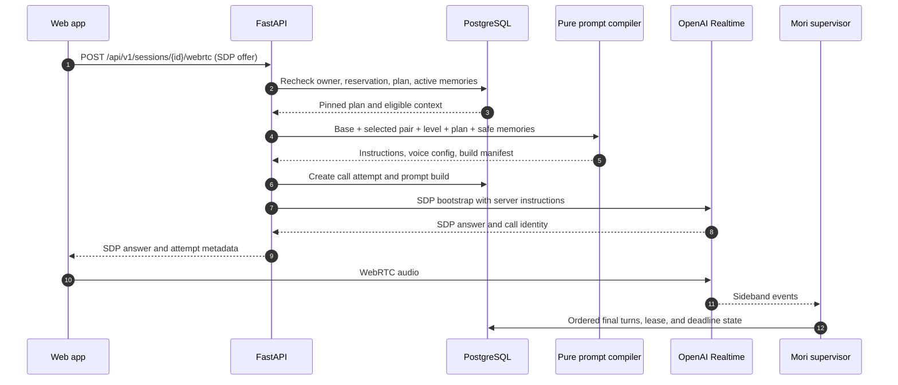

# Learning system implementation design

**Status:** Approved design for implementation handoff

**Date:** September 26, 2026

**Product contract:** [Mori learning system PRD](../learning-system-prd.md)

This design fits the approved modular-monolith architecture. It specifies how onboarding, planning, Realtime prompting, evidence, memory, and read models exchange information. The first implementation should support one published language pair; the contracts must require explicit selection and support more pairs without changing their shape.

## 1. Current state and migration boundary

The repository already has Google sign-in, an opaque application session, an intro grant, per-profile correction and pace preferences, `POST /api/v1/sessions`, a reserved session, and a one-objective placeholder plan. It does not yet have a published curriculum, learning snapshots, memory persistence, a prompt compiler, a live Realtime adapter, or post-session analysis.

The current sign-in path creates an English-to-Mandarin profile automatically. `GET /api/v1/me` joins through that profile and returns a non-null `activeLanguageProfile`; the web validator also requires it. The current level type and earlier PRD contain six values. Those are migration inputs, not the new product contract.

Migration rules:

1. New sign-in creates an account and intro grant, but no language profile. `GET /me` succeeds with `activeLanguageProfile: null`, `preferences: null`, and `onboarding.complete: false`.
2. Existing auto-created profiles get `language_selection_confirmed_at = NULL`. They cannot start new sessions until the learner explicitly chooses a supported pair. Do not preselect the legacy pair in onboarding. If the learner chooses it, confirm the existing row; if they choose another pair, activate the selected profile and archive the unused legacy row under the one-active-profile rule.
3. The original six-value mock and UI contract moves to `beginner | intermediate | advanced | fluent`. There is no automatic persisted-level mapping because the assessment tables are not implemented. Any future migration of assessed records must re-evaluate evidence under a versioned four-level rubric.
4. Existing session rows and placeholder plans remain readable with their pinned placeholder versions. Add a plan schema discriminator and new nullable columns first; backfill legacy rows as `legacy_placeholder`, then require the complete new contract for newly created plans. The read path handles both shapes. New planning never edits an old plan.
5. `GET /me`, the generated client, runtime validators, and onboarding routes must land together before auto-provisioning is removed.

## 2. Module ownership and information flow

| Module | Receives | Owns and returns | May not decide |
| --- | --- | --- | --- |
| Identity/users | Google identity, user details, application session | Authenticated user ID, user status, composed `/me` query | Curriculum eligibility or assessed mastery |
| Learner profile | Onboarding command, preference edits | Confirmed language profile, practice mode, self-reported level, preferences, optional interests | Assessed mastery |
| Curriculum | Course publication and content rules | Published pair and versioned eligible content | Entitlement, live turns, session state |
| Session orchestration and planning | Authenticated learner, profile, learning snapshot, curriculum, idempotency key, connection facts | Valid objective selection, immutable plan and preview, session state, reservation coordination, final watermark | Prompt wording, evidence extraction, level promotion |
| Prompt compiler | Pinned plan, profile languages, selected safe context, policy versions | Server-only instructions and voice configuration | Durable learner state changes |
| Realtime supervisor | Provider sideband events, call identity, plan/call metadata | Normalized ordered turns, leases, time enforcement, interruption and finalization | Curriculum eligibility or memory writes |
| Analysis/learning | Final session bundle, transcript turns, curriculum and rule versions, current consent | Validated evidence, deterministic item state, level assessment, recap, snapshot, permitted memories | Entitlement or unvalidated model-owned writes |
| Read models | Module queries | Dashboard, plan preview, recap, memory list | Source-of-truth writes |

The API, supervisor, and worker are process entry points into these modules, not separate business services. Their shared durable coordination is PostgreSQL. No model call runs while a row lock is held.

### Session sequence

1. The web client fetches the supported language-pair catalog and `GET /me`. Incomplete onboarding sends the learner to explicit selection.
2. `POST /language-profiles` creates or confirms the explicitly chosen pair, preferences, self-reported level or Fluent practice mode, and optional interests in one transaction. This command completes onboarding.
3. The web client optionally submits a session topic and requested words with `POST /sessions` and an `Idempotency-Key`.
4. The API checks onboarding, profile ownership, supported pair, and entitlement. It reserves the entitlement in a short transaction and pins the profile and curriculum versions.
5. The planner loads the latest committed snapshot, due items, repair needs, and eligible memories; it selects eligible objectives without provider access. A second short transaction stores the immutable plan if the session and reservation remain valid. If the profile or preference version changed during planning, retry from a fresh context before committing.
6. During SDP bootstrap, the API rechecks that selected memories remain active, compiles the shared prompt with the published pair policy and one level block, persists a call-level prompt-build record, and sends server-built configuration to Realtime. A deleted memory is omitted; a topic based only on that memory falls back to a generic safe question. The browser receives no raw system prompt.
7. The supervisor persists ordered final turns. On a usable end, it fixes the watermark and atomically inserts the analysis job with the session transition.
8. The worker reads the pinned bundle. Learning mode validates candidate evidence and commits derived state, recap, snapshot, and permitted memories atomically. Fluent mode commits only the brief summary and permitted memories. A later plan reads the last committed snapshot.

If a memory is deleted during an active provider call, the session must stop using that call's old context. End the provider call and create a sanitized replacement under the same Mori session if remaining time allows; otherwise end the session. This behavior must be verified with the provider adapter before memory deletion is offered during an active call.

## 3. Technology choices

| Concern | Technology and role |
| --- | --- |
| Browser | React, TypeScript, React Query, generated OpenAPI client, and Zod runtime validators. Existing `WebAppGateway` and `RealtimeSessionFactory` remain adapters. |
| Public API | FastAPI with Pydantic v2 schemas and existing opaque cookie, origin, CSRF, `If-Match`, and idempotency conventions. |
| Domain and persistence | Python 3.13 pure selectors and rule functions; SQLAlchemy 2 asyncio, PostgreSQL, and Alembic migrations. |
| Live voice | OpenAI Realtime over browser WebRTC, server SDP bootstrap, and server sideband supervision. Model and voice remain runtime aliases. Use the current Realtime 2.0 prompting guide as the prompt design baseline and evaluate a low reasoning-effort starting configuration. |
| Post-session extraction | OpenAI Responses adapter with a versioned structured candidate schema. Model output is untrusted until application validation. |
| Durable work | PostgreSQL-backed Procrastinate jobs inserted transactionally at session finalization. This dependency enters with the analysis worker slice; it is not in the current backend package yet. |
| Observability | Existing structured logging and planned OpenTelemetry correlation. Do not export transcript text, memory content, audio, or raw prompts into general telemetry. |

One Python package and deployment image continues to produce `mori-api`, `mori-realtime-supervisor`, and `mori-analysis-worker`. The selector and prompt compiler are separately testable modules, not additional deployed services.

## 4. Public API contract

Pydantic is the server contract. Export OpenAPI and generate the TypeScript client and Zod validators. All examples use camelCase JSON. Authenticated mutations require the existing cookie, allowed origin, and CSRF token. Ownership is checked in application use cases.

Resource ownership determines the URL: `/me` is the current account and its active-profile selection; `/language-profiles/{id}` owns pair-specific preferences, learning settings, and memories; `/sessions/{id}` is a separate timed resource tied to one profile. The published pair catalog is independent of a learner. URL nesting expresses ownership, not the SQLAlchemy ORM mapping. Avoid a second `/onboarding` mutation that duplicates profile creation.

| Route | Request and result | Key failure or consistency rule |
| --- | --- | --- |
| `GET /api/v1/language-pairs` | Supported base/target pairs, course display names, and availability. | Only published pairs are selectable for voice; frontend marketing options are not authority. |
| `GET /api/v1/me` | User, onboarding steps, nullable active profile, nullable preferences, CSRF token. | Works before a profile exists. `Cache-Control: no-store`. |
| `POST /api/v1/language-profiles` | Required base/target IDs and starting level or `unsure`; optional preferences and interests. Creates or confirms the selected pair, makes it active, and returns the profile plus current learner. | Atomic onboarding command and `Idempotency-Key`; same key and different payload returns `409`. Pair must be published. A new pair starts with empty learning state and memories. |
| `PUT /api/v1/me/active-language-profile` | Owned confirmed `languageProfileId`; returns current learner. | Transactionally archives the prior active row, activates the selected row, and increments account version; never copies learning evidence across profiles. Requires `If-Match` on the user view. |
| `PATCH /api/v1/language-profiles/{id}/learning-settings` | Changes the chosen mode or provisional placement. | Requires `If-Match`. Switching from Fluent practice to learning mode starts provisional placement and a diagnostic; it does not invent an assessed level. |
| `PATCH /api/v1/language-profiles/{id}/preferences` | Correction frequency, pace, timezone, captions, and optional interests. Returns profile preferences and new ETag. | `If-Match` required; `428` missing, `412` stale. No silent lost update. |
| `POST /api/v1/sessions` | `languageProfileId`, optional `topic`, bounded `requestedWords[]`; returns session ID, state, reservation expiry, mode, and safe plan preview. | Requires `Idempotency-Key` and request digest. Missing/unsupported profile returns a stable onboarding/course error before reservation. |
| `GET /api/v1/sessions/{id}` | State, authoritative time, reconnect eligibility, plan preview, and recap readiness. | Never returns the raw prompt or hidden memory context. |
| `POST /api/v1/sessions/{id}/webrtc` | Browser SDP offer; returns SDP answer and call attempt metadata. | Revalidate ownership, reservation, profile, plan, memory eligibility, and current call state before provider request. |
| `GET /api/v1/sessions/{id}/recap` | Discriminated `learning` or `practice` result plus `processing | ready | failed` status. | Fluent practice has summary and memory references, without objective scores or advice fields. |
| `GET /api/v1/language-profiles/{id}/memories` | Cursor-paginated inspectable memory entries. | Only active memories owned by the profile. |
| `DELETE /api/v1/language-profiles/{id}/memories/{memoryId}` | Idempotent `204` after revocation. | Check both profile and memory ownership. Deleted memory cannot reappear from a retry or replay. Active-call context is sanitized as described above. |

The existing `PATCH /api/v1/me/preferences` and any shipped memory routes remain temporary compatibility adapters for the active profile while the generated client moves to the profile-scoped routes. They use the same application command and ETag rules, then can be retired in a versioned API change. Existing `POST /api/v1/sessions` remains top-level; its required `languageProfileId` pins the session's ownership and avoids a duplicate nested session API.

### Workflow paths

These sequence diagrams are the handoff view of the five flows in the approved review. Every arrow entering PostgreSQL represents a repository operation or short transaction; the pure selector and compiler do not query the database or call a model.

#### 1. Explicit onboarding

```mermaid
sequenceDiagram
    autonumber
    participant Web as Web app
    participant API as FastAPI
    participant Identity as Identity module
    participant DB as PostgreSQL
    Web->>API: GET /api/v1/language-pairs + GET /api/v1/me
    API->>Identity: Load catalog and current learner
    Identity->>DB: Read published pair and account
    DB-->>Identity: Catalog; nullable active profile
    Identity-->>API: Onboarding view
    API-->>Web: Supported choices and current state
    Web->>API: POST /api/v1/language-profiles (explicit pair, level, preferences)
    API->>Identity: Validate command and idempotency key
    Identity->>DB: Transaction: confirm pair, profile, settings, preferences, active status
    DB-->>Identity: Profile ID and versions
    Identity-->>API: Current learner
    API-->>Web: Confirmed profile and onboarding complete
```

New accounts have no profile. An unconfirmed legacy row becomes usable only after explicit selection. The unique user/pair and one-active-profile constraints are checked in the transaction.

#### 2. Session planning

```mermaid
sequenceDiagram
    autonumber
    participant Web as Web app
    participant API as FastAPI
    participant DB as PostgreSQL
    participant Planner as Pure selector
    Web->>API: POST /api/v1/sessions (profileId, topic, words, Idempotency-Key)
    API->>DB: Check profile, pair, entitlement; reserve capacity
    DB-->>API: Reservation and pinned versions
    API->>DB: Read course, settings, latest committed snapshot, due items, safe memory refs
    DB-->>API: Bounded planning context
    API->>Planner: build_session_plan(context, curriculum, ruleVersion)
    Planner-->>API: Eligible objectives or Fluent focus
    API->>DB: Check versions; commit immutable plan in short transaction
    DB-->>API: Session ID and plan version
    API-->>Web: Reservation and safe plan preview
```

If planning fails, the reservation is released or expires. If profile, preference, or settings versions change before commit, the API reloads context and recomputes. A first session has no snapshot; a delayed analysis never exposes an uncommitted one.

#### 3. Voice bootstrap and live supervision



The browser never receives raw instructions. Reconnect creates a new call attempt and prompt build under the same plan, after filtering memories again. Provider calls happen outside row locks.

#### 4. Analysis and the next plan

```mermaid
sequenceDiagram
    autonumber
    participant Supervisor as Mori supervisor
    participant DB as PostgreSQL + Procrastinate
    participant Worker as Analysis worker
    participant Extractor as OpenAI Responses
    participant Web as Web app
    participant API as FastAPI
    Supervisor->>DB: Transaction: final turn watermark, session state, ID-only job
    Worker->>DB: Claim job; load pinned plan and finalized turns
    DB-->>Worker: Versioned analysis bundle
    Worker->>Extractor: Structured candidate request
    Extractor-->>Worker: Turn-cited candidates
    Worker->>Worker: Validate provenance, policy, confidence, and consent
    Worker->>DB: Atomic commit: run, recap, permitted memory, learning state if applicable
    Web->>API: GET /api/v1/sessions/{id}/recap
    API->>DB: Read current successful recap
    DB-->>API: Learning or practice projection
    API-->>Web: Recap or processing status
```

The next session plan reads the latest committed snapshot. Fluent practice stores a brief summary and permitted memories, with no learning evidence, assessment, or snapshot. Worker retry uses the same run identity and cannot duplicate derived records.

#### 5. Memory revocation

```mermaid
sequenceDiagram
    autonumber
    participant Web as Web app
    participant API as FastAPI
    participant DB as PostgreSQL
    participant Compiler as Prompt compiler
    participant Supervisor as Mori supervisor
    participant Realtime as OpenAI Realtime
    Web->>API: DELETE /api/v1/language-profiles/{id}/memories/{memoryId}
    API->>DB: Check ownership; clear fact text; write suppression tombstone
    DB-->>API: Revoked memory and affected call attempts
    API-->>Web: 204 No Content
    opt Future bootstrap
        API->>Compiler: Compile with current active memories only
        Compiler-->>API: Revoked fact excluded
    end
    opt Memory already in a live call
        API->>Supervisor: Invalidate affected call context
        Supervisor->>Realtime: End old call; replace with sanitized context if time allows
        Supervisor->>DB: Persist replacement attempt or session end
    end
```

The tombstone survives source-memory deletion and prevents analysis replay from recreating the same fact. The provider adapter must prove call replacement works before active-call memory deletion is exposed to learners.

Profile creation and onboarding request:

```json
{
  "baseLanguageId": "english",
  "targetLanguageId": "mandarin",
  "startingChoice": "beginner",
  "correctionPreference": "balanced",
  "tutorPace": "level",
  "interests": ["cooking", "weekend walks"]
}
```

`startingChoice: "fluent"` selects practice mode immediately. `startingChoice: "unsure"` produces provisional Beginner learning mode. Neither option asserts an assessed level.

Session request:

```json
{
  "languageProfileId": "f34c7789-d4da-4a96-887e-854acb74380a",
  "topic": "my weekend",
  "requestedWords": ["market", "recipe"]
}
```

The session response exposes objective labels or a conversation focus, not curriculum gate internals, private memories, or model instructions. Bound topic length, word count, and individual word length in schema and domain validation. A repeated idempotency key returns the original session only when the request digest matches.

Error codes to freeze with OpenAPI include `onboarding_required`, `language_pair_unavailable`, `profile_version_conflict`, `session_setup_invalid`, `plan_unavailable`, `session_not_connectable`, and `memory_not_found`. Use the existing stable error envelope.

## 5. Persistence contract

PostgreSQL remains the source of truth. Core relationships use foreign keys and uniqueness constraints; bounded JSONB is limited to versioned structured context or candidate payloads. `timestamptz` stores instants. The companion [data contract and object structure](learning-system-data-contracts.md) defines every new record, the extended existing records, API read models, and cross-record invariants.

### Existing tables to extend

| Table | Change | Constraint or lifecycle |
| --- | --- | --- |
| `users` | Keep `onboarding_completed_at`; add account `version`; sign-in no longer implies a profile. | The timestamp is written only with a confirmed supported profile and starting mode. Account version advances on onboarding completion and active-profile changes for `If-Match`. |
| `language_profiles` | Add `language_selection_confirmed_at` and profile `version`. Existing base/target fields remain required for rows that exist. | New user has no row until onboarding. Keep one active profile per user and unique user/pair. Legacy auto-created rows remain unconfirmed until explicit selection. |
| `learner_preferences` | Add bounded `interests` structured payload under existing optimistic `version`. | Enforce item count, normalized text length, and safe edit semantics. Preferences remain profile-scoped. |
| `session_plans` | Add `schema_version`, mode, nullable snapshot ID, profile/preference/settings versions, selected level, topic, setup digest, published curriculum FK, and base/pair/level policy versions. Retain old string version columns for `legacy_placeholder` reads. | One immutable plan per session. New rows require the full new contract; old rows remain readable. First session has no snapshot; objectives count remains one to three including a single ungraded Fluent conversation focus. |
| `session_plan_objectives` | Add objective kind and nullable curriculum-item reference; keep ordinal. Map the existing `text` to the learner-facing label in the new read model. | `curriculum_item_id` is required for graded curriculum objectives and absent for ungraded Fluent focus. |
| `sessions` | Keep owner, profile ID, state, idempotency digest, and duration. Add a request digest if stored outside the plan. | Same idempotency key with changed setup body is a conflict. Profile and plan are pinned for the session. |

### New records

| Record | Key fields | Invariant |
| --- | --- | --- |
| `profile_learning_settings` | `language_profile_id` PK/FK, raw starting choice, provisional level, `mode`, `version`, created/updated times. | `unsure` remains distinguishable from a chosen Beginner. `fluent` selects practice mode. Assessed level comes from validated assessments, not this row. |
| `course_catalog` | ID, base-language ID, target-language ID, availability, pair-policy version, voice-policy version. | Unique language pair. A pair is selectable only when it has a published curriculum and language-pair voice policy. |
| `curriculum_versions` | ID, course-catalog ID, version, publication status and time. | Unique pair/version. Only a published version can enter a new plan; published content is immutable. |
| `curriculum_items`, `curriculum_edges`, `evidence_rules` | Versioned item key, skill type, level, prerequisite edges, and rule definitions. | References stay within one curriculum version. Cycles fail publication. |
| `session_plan_memory_refs` | Session-plan ID and memory ID. | Deletion/revocation removes eligibility. It never embeds raw memory text in the plan. |
| `session_call_attempts` | Session ID, attempt number, provider call ID, status and timestamps. | A reconnect creates a new attempt under the same immutable plan; prompt builds and turns refer to an exact attempt. |
| `session_prompt_builds` | Call attempt ID, plan ID, base-policy version, pair-policy version, level-block version, model/voice config versions, selected memory IDs, instructions hash, creation time. | One build per call attempt. No raw instructions or memory text in general logs. Reconnect can rebuild from the same plan with revoked context removed. |
| `session_turns` and `analysis_runs` | Ordered turn identity, final watermark, run ID, mode, schema/model/prompt/rule versions, status. | Provider-event deduplication and one successful commit per session/run version. |
| `learning_evidence`, `learner_item_states`, `level_assessments`, `learner_state_snapshots` | Profile, session, exact turn IDs, curriculum and rule versions, confidence, derived item and level state. | Learning mode only. Evidence and snapshots append decisions rather than silently rewriting them. |
| `recaps` | Session ID, mode, status, brief summary, versioned learning-only fields where applicable. | One current recap per analyzed session. Practice recaps have no objective outcomes, corrections, or level advice. |
| `memories`, `conversation_hooks`, `memory_suppressions` | Profile, source session/turns, normalized fact or hook, confidence, sensitivity, expiry, revocation; suppression source identity. | Only explicitly volunteered safe content. A deletion tombstone prevents analysis retry or newer-version replay from resurrecting the same fact. |

Index the latest snapshot per profile, due item state, published curriculum by language, active memories by profile/expiry, analysis-run idempotency, and session recovery by state/deadline. Keep memory and evidence provenance linked to the source session so approved cascade deletion can remove and rebuild derived state.

### Immutable and deletable data

A plan pins the profile version, selected curriculum, selector version, prompt policy, and source snapshot. The selected memory list is a revocable reference set rather than immutable memory text. On memory deletion, the memory row is revoked immediately, the prompt compiler filters it, and `memory_suppressions` prevents replay resurrection. Session deletion removes transcript, recap, memories, hooks, and session-derived evidence, then rebuilds affected learning state under the existing privacy design.

## 6. Planning and prompt contracts

`build_session_plan(context, published_curriculum, rule_version) -> SessionPlan` is a pure domain function. It returns one to three eligible objectives in learning mode, or one ungraded conversation focus in practice mode. Selection inputs are typed and bounded. Deterministic tie-breakers make replays stable. A model may propose topic wording after selection, but cannot alter objective IDs or prerequisites.

`compile_realtime_config(plan, profile, pair_policy, level_policy, selected_memories, policy_versions) -> RealtimeConfig` is pure and separately testable. It composes one generic versioned base prompt, one published language-pair module, one level block, and bounded current plan and historical context. It validates required profile languages, prompt size, memory eligibility, and unsupported policy combinations. The output includes instructions, a voice configuration, and a build manifest. The API owns the provider call; the compiler never contacts OpenAI or writes learner state.

The first pair module can specialize English as the base language and Mandarin as the target language: Standard Mandarin voice delivery, brief English rescue scaffolds, Mandarin examples, and pair-specific pronunciation wording. It must be selected from the confirmed profile and course catalog, never from an application default. The generic base prompt keeps reusable tutor behavior, turn shape, uncertainty handling, and memory safety; the pair module must not repeat these rules. Changing pair wording increments its own version so evaluations can isolate a language-specific change from a base or level change.

Prompt sections follow the current [OpenAI Realtime prompting guide](https://developers.openai.com/api/docs/guides/voice-prompting): role, selected target and base language, tone and turn shape, injected level behavior, proactive conversation flow, pronunciation support, current objectives and historical context, unclear audio, tool policy when tools exist, and safety. Keep target-language selection separate from tutor accent and playback speed. Use context labels and freshness so old memories cannot be mistaken for current facts. Test the provider's default preamble behavior before adding a rule. Model alias and reasoning effort remain configurable and are selected by voice evaluations.

The live tutor proactively opens, responds, asks a relevant follow-up, and pivots when a topic stalls. It pauses to scaffold when the learner struggles. Pronunciation feedback requires a clear useful signal, one specific correction and model, and an invitation to retry. Uncertain audio prompts clarification. Fluent practice receives corrections only on request.

## 7. Analysis contracts

At finalization, the session records a final turn watermark and inserts an ID-only Procrastinate job in the same transaction. The worker loads the pinned transcript and plan. Its extraction schema is a discriminated union:

- `learning`: summary, objective evidence with exact turn IDs, vocabulary and concept candidates, correction examples, assessment observations, permitted insight candidates, and transcript-quality flags.
- `practice`: brief summary, permitted insight candidates, and transcript-quality flags. Learning evidence and level fields are not present in this schema.

Candidates pass schema, ownership, turn provenance, confidence, sensitivity, curriculum-version, and current deletion/consent checks. Pure versioned rules derive learner item state and assessed level. A successful learning transaction commits accepted evidence, derived state, assessment, recap, memory, hooks, snapshot, and run status together. A successful practice transaction commits summary, permitted memory, and run status, with no learning snapshot or level change.

The initial evaluator uses transcripts, including tutor turns that offer a pronunciation correction, model, and retry. It can score whether the tutor behaved gently and avoided an unsupported claim; it cannot establish whether the learner actually pronounced a sound correctly. Pronunciation evidence for progression remains disabled until an approved retained-audio policy and a reliable audio evaluator exist. A live conversational correction does not by itself prove mastery or a level change.

## 8. Failure, concurrency, and privacy behavior

| Situation | Required result |
| --- | --- |
| Profile languages absent or course unpublished | Return a stable onboarding/course error before entitlement reservation or provider call. |
| Same onboarding/session idempotency key replayed | Return the original resource for the same payload; reject changed payload. |
| Preferences change while planning | Detect version mismatch and recompute before committing the plan. |
| Planning fails after reservation | Release or expire the unconsumed reservation and leave a recoverable session state. |
| Analysis is delayed or fails | Next plan reads the last committed snapshot; recap reports processing or failed status. |
| Memory expires or is deleted before bootstrap | Filter it and use a safe generic topic if needed. Do not send it to Realtime. |
| Memory is deleted during an active call | Replace the provider call with sanitized context or end the session; do not keep using the old call. |
| Worker retry or provider event replay | Unique run/event keys prevent duplicate turns, evidence, recaps, memories, and snapshots. |
| Fluent session | Never invoke learning progression; persist only practice summary and permitted memories. |
| Session deletion | Revoke access first, delete sourced artifacts, and rebuild learner state from remaining evidence. |

## 9. Delivery slices and gates

1. **Profile and onboarding:** nullable `GET /me`, supported-pair catalog, explicit onboarding mutation, legacy-profile confirmation migration, four-level web type, optional interests. Gate: new and legacy accounts cannot start without explicit supported selection; old auth behavior remains valid.
2. **Curriculum and deterministic planning:** published first course, starter objectives, placement and review rules, session topic/word inputs, pure selector, immutable plan migration. Gate: fixtures and PostgreSQL tests prove eligibility, deterministic replay, idempotent creation, and reservation cleanup.
3. **Prompt compiler:** versioned generic prompt, published pair modules, level blocks, proactive conversation and pronunciation rules, bounded memory selector, call-level build manifest. Gate: prompt snapshots, prompt-conflict checks, explicit English-to-Mandarin selection, and memory deletion before bootstrap.
4. **Realtime integration:** SDP adapter and supervisor send server-built configuration, record build version, persist turns, handle reconnect and mid-call memory revocation. Gate: a real voice session follows the plan and remains recoverable after process loss.
5. **Analysis and read models:** structured candidate schemas, validation, deterministic progression, snapshots, memories and suppressions, learning/practice recaps, dashboard projections. Gate: exact-turn provenance, Fluent isolation, retry safety, deletion and rebuild tests.
6. **Transcript-based product evaluation:** four-level scripted and captured transcript fixtures for language adherence, proactive follow-up, scaffold length, whether tutor-offered pronunciation repair is gentle and appropriately uncertain, memory safety, and extraction validity. Gate: published transcript thresholds pass before the feature is enabled for learners. This gate makes no claim about acoustic pronunciation accuracy or audio quality; validate live call transport separately. Add retained-audio evaluation before pronunciation can affect progress.

The existing backend implementation plan schedules complete planning after the first live and analysis slices. Pure curriculum selection and prompt compilation can be built earlier behind their module interfaces. Do not treat a prompt snapshot test as proof of live spoken behavior.

## 10. Decisions still required before release

- Initial supported language pair or pairs and their published course content.
- Numeric level thresholds, curriculum promotion gates, and accepted evaluation thresholds.
- Prompt, Realtime model, voice, and extraction model versions after transcript review and live-call transport validation.
- Exact memory retention policy. An approved audio evidence policy and evaluator are required only before pronunciation-derived progress is enabled.

These are release gates, not reasons to leave API shapes or module ownership undefined.
