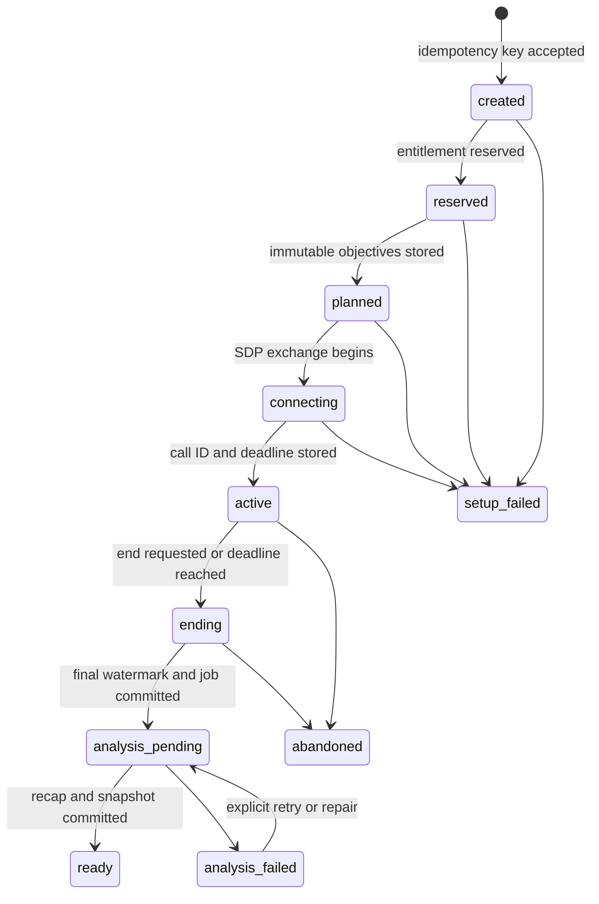
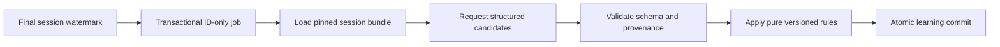

# Runtime services and flows

This document defines the three deployable process types in the Mori backend and the durable workflows that connect them. They are independently scaled runtimes of one modular monolith, not independently versioned microservices.

## Shared deployment contract

All runtimes:

- Ship from the same immutable backend image and application version.
- Import the same domain and application modules.
- Use one PostgreSQL schema and one ordered Alembic migration stream.
- Communicate through committed database state, not private HTTP calls.
- Emit compatible structured logs, traces, metrics, and version labels.
- Stop accepting or claiming new work before graceful shutdown.

Deployment order is:

1. Run `uv run alembic upgrade head` as a singleton pre-deploy task.
2. Stop the rollout if the migration fails.
3. Start or roll the API, supervisor, and worker only after the schema is compatible.

## `mori-api`

**Entry point:** `uv run uvicorn mori.api.main:create_app --factory`

FastAPI owns every synchronous public backend request. It authenticates callers, validates transport contracts, invokes one bounded application use case, owns the request transaction boundary, and maps results to the versioned HTTP contract.

| Direction | Interfaces |
| --- | --- |
| Inbound | Google auth start and callback, `/api/v1` JSON requests, SDP offers, Stripe webhooks, health, and readiness |
| Outbound | Google OIDC, OpenAI SDP endpoint, Stripe API when required, PostgreSQL, and scoped private S3 upload or export URLs |
| Scale signals | Request rate, p95 latency, CPU, and database connection pressure |

Failure rules:

- A failed request commits one valid state transition or nothing.
- External requests are separated from short locking transactions.
- Retried create operations return the result associated with the original idempotency key.
- The API does not keep a realtime call alive, own the session timer, or run model analysis after returning.
- Readiness fails when required database or configuration dependencies cannot safely serve traffic. Provider degradation should surface through the affected use case without making unrelated reads unavailable.

## `mori-realtime-supervisor`

**Entry point:** `uv run python -m mori.runtime.supervisor`

The supervisor is a dedicated asyncio process for OpenAI Realtime sideband connections. It normalizes provider events, persists ordered turns, renews ownership leases, accounts for connected time, enforces the server deadline, and finalizes interrupted or abandoned calls.

| Direction | Interfaces |
| --- | --- |
| Inbound | No public route. PostgreSQL `NOTIFY` provides low-latency wake-up and a lease scan provides durable recovery. |
| Outbound | OpenAI sideband WebSocket and hangup API, plus short idempotent PostgreSQL writes |
| Scale signals | Active supervised calls, event throughput, lease acquisition delay, and connection pressure |

Failure rules:

- A renewable lease gives one supervisor temporary ownership of a call.
- Lease expiry allows another instance to reclaim the call after a crash or network partition.
- Every instance scans for recoverable or overdue calls. A missed notification cannot strand a session.
- Provider event IDs and sequence metadata make turn ingestion safe to repeat.
- Deadline enforcement, hangup, and finalization are idempotent.
- Graceful shutdown stops new claims, then drains active calls or explicitly relinquishes their leases.

## `mori-analysis-worker`

**Entry point:** `uv run python -m mori.runtime.worker`

The worker runs post-session extraction and deterministic learning updates. It also runs retention expiry, exports, deletion, account erasure, retrospective review support, and repair work.

| Direction | Interfaces |
| --- | --- |
| Inbound | Durable Procrastinate jobs inserted through the application's existing PostgreSQL connection and transaction |
| Outbound | OpenAI Responses API, PostgreSQL, and private S3 for consented audio and user exports |
| Scale signals | Oldest-job age, queue depth by task type, model rate limits, retry counts, and database write contention |

Failure rules:

- Job payloads contain stable record identifiers and required version pins only.
- Retries reuse a unique analysis run and pipeline version.
- The worker reloads authoritative inputs by identifier on every attempt.
- Model candidates are disposable. Only one validated atomic commit becomes authoritative.
- Poison jobs become visible through bounded retries, failure status, alerts, and a repair path.

## Session state machine

Session state is persistent data, not controller memory.

Valid transitions use compare-and-set updates against the expected prior state. A transition records its reason and relevant timestamps. Blind status writes are forbidden.

The state names describe the main success path. Detailed end reasons, connection attempts, analysis attempts, and provider facts remain separate typed records so the session row does not become an unstructured event log.

## Session start flow

1. The browser sends `POST /api/v1/sessions` with an `Idempotency-Key`.
2. In one short transaction, the API creates or reuses the session attempt and reserves an available intro or paid grant under a row lock.
3. Planning runs outside the entitlement lock using a pinned learner snapshot and published curriculum version.
4. The API stores the immutable plan and objective records. An expired setup reservation can be released safely.
5. The browser sends its SDP offer to `POST /api/v1/sessions/{id}/webrtc`.
6. The API verifies ownership, state, and reservation, then exchanges SDP with OpenAI without holding the entitlement lock.
7. The API persists the provider call ID, server deadline, and active state before returning the SDP answer.
8. Committed call state wakes a supervisor. The browser sends media directly to OpenAI while the supervisor attaches through the sideband connection.
9. The first usable learner turn atomically consumes the reservation. Setup failure with no usable turn releases it.

No external call may occur while a transaction holds an entitlement row lock. If the SDP exchange succeeds but the final state update fails, recovery uses the persisted attempt data and provider cleanup path rather than creating an unbounded second call.

## Live supervision and reconnect

The server stores:

- Provider call ID.
- Absolute server deadline.
- Connected segments and their start and end times.
- Accumulated connected duration.
- Final persisted provider-event and turn watermarks.
- Current supervisor lease owner and expiry.
- End request and terminal reason.

The browser may display a timer, but `GET /api/v1/sessions/{id}` returns the authoritative connected time and remaining cap. Reconnect creates another connection segment and never resets time already consumed. At the cap, the supervisor stops new output, invokes provider hangup, closes the current segment, and finalizes the session even if the browser has disconnected.

## Session end and analysis handoff

Ending is safe to repeat whether triggered by the learner, the provider, a disconnect policy, or the deadline:

1. Persist the end request or observed terminal event.
2. Stop provider output and request hangup when needed.
3. Close the final connection segment.
4. Fix the final turn watermark and total connected time.
5. Decide whether the session has at least one usable learner turn.
6. Consume or release the entitlement reservation according to that decision.
7. For a usable session, transition to `analysis_pending` and defer an analysis job on the same PostgreSQL connection and in the same transaction.
8. For a non-usable session, record the appropriate failure or abandoned terminal without queuing learning analysis.

The queue write and session transition cannot succeed independently.

## Durable learning flow

The worker:

1. Claims the unique analysis run.
2. Loads the transcript only through the final watermark, the immutable plan, the published curriculum version, learner snapshot, and current consented audio metadata.
3. Reads audio only when the consent is current, the asset is complete, and retention has not expired.
4. Sends a bounded, versioned bundle to the extraction adapter.
5. Rejects schema drift, unknown turn references, unsupported claims, invalid memory, and evidence below the configured threshold.
6. Runs deterministic progression and level rules without provider access.
7. Commits accepted evidence, current item states, assessment, recap, memories, conversation hooks, immutable snapshot, and analysis status in one transaction.

Replay with the same inputs and versions must produce the same domain decision. A newer analysis or policy version creates a new run and snapshot rather than editing history.

## Transaction boundaries

| Boundary | Atomic work | Work kept outside the lock |
| --- | --- | --- |
| Create session | Session attempt plus entitlement reservation | Planning and all provider calls |
| Persist plan | Immutable plan, objectives, and pinned versions | Optional model-assisted theme generation |
| Activate call | Expected state, call ID, deadline, and wake-up state | SDP exchange |
| Ingest realtime event | Provider deduplication, ordered turn update, and watermark | Waiting on sideband events |
| Finalize usable session | Terminal facts, reservation consumption, `analysis_pending`, and job insertion | Hangup request and later analysis |
| Apply analysis | Evidence, derived state, recap, snapshot, and successful run status | Extraction request |
| Apply Stripe event | Event deduplication and monotonic subscription projection | Optional Stripe retrieval |
| Begin privacy job | Immediate access revocation and durable job insertion | Object deletion, export generation, and state rebuild |

## Minimum runtime verification

- Concurrency tests prove that one remaining grant cannot be reserved twice.
- Replay tests prove that repeated provider events do not duplicate turns.
- Lease tests prove supervisor takeover after process loss.
- Deadline tests prove the 20-minute cap without a connected browser.
- Transaction tests prove session finalization and job insertion are atomic.
- Analysis replay tests prove a retry cannot append duplicate evidence or snapshots.
- Shutdown tests prove leases and jobs are drained or recoverable.
