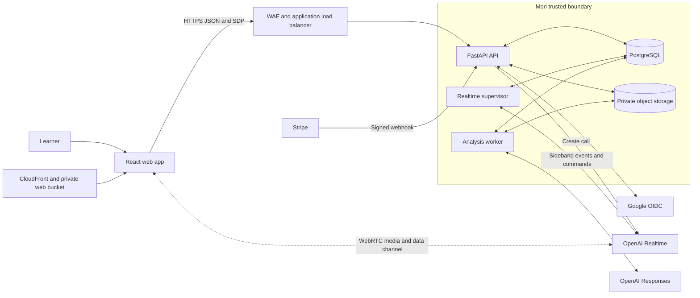
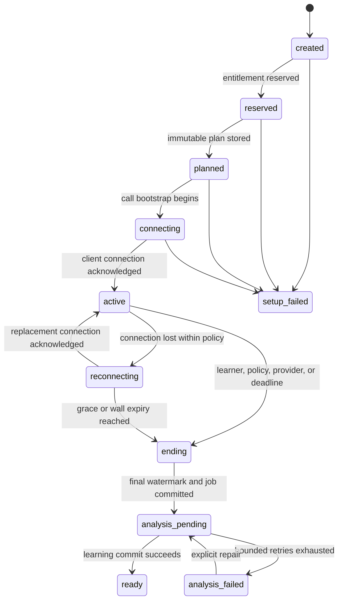
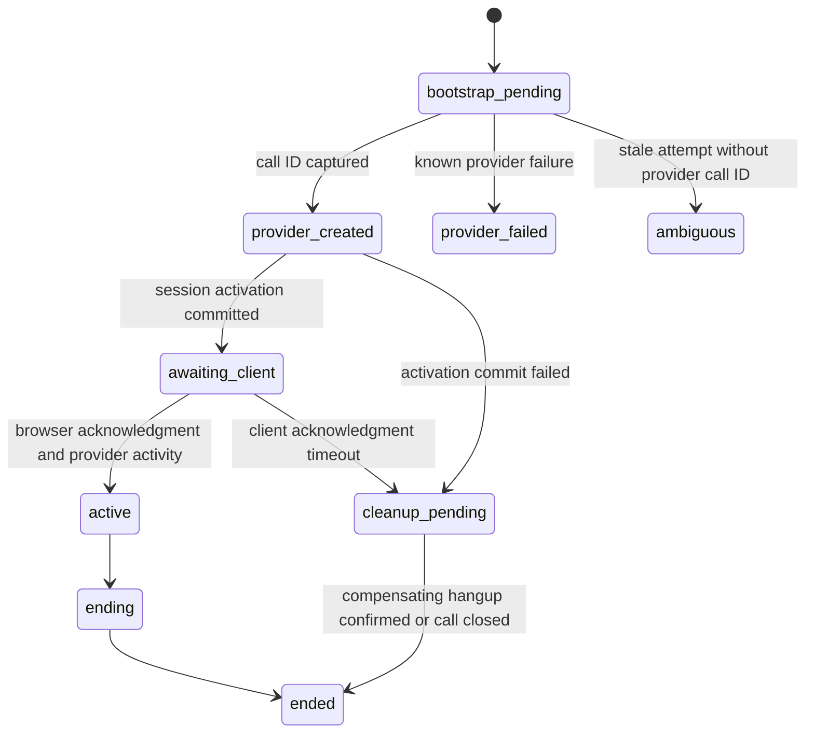
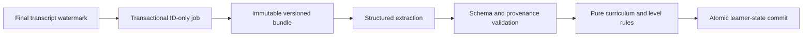

# Mori MVP system design

**Status:** Approved September 23, 2026

**Date:** September 23, 2026

**Companion to:** [Product requirements](../PRD.md)

## 1. Purpose and approval scope

This document is the implementation-facing system design for the Mori MVP. The PRD remains authoritative for learner-visible behavior. This document defines the topology, trust boundaries, runtime ownership, state machines, data contracts, failure recovery, and verification required to implement that behavior without inventing architecture during delivery.

Approval of this document means the following are accepted:

- One Python modular monolith deployed as three independently scaled process types.
- PostgreSQL as the source of truth and durable workflow substrate.
- Direct browser-to-OpenAI WebRTC media with server-controlled SDP exchange and sideband supervision.
- One Mori session containing one or more sequential provider calls, with at most one active provider call.
- Deterministic entitlement, curriculum, progression, privacy, and lifecycle rules around model calls.
- Explicit recovery behavior for duplicate requests, process loss, provider failure, and asynchronous retries.

Approval does not supply missing product content. The initial curriculum, level thresholds, model aliases, billing lifecycle policy, audio retention duration, evaluator thresholds, AWS region, and operational ownership remain release gates listed in section 16.

## 2. Design goals

The system prioritizes correctness, recovery, and auditability over implementation convenience.

1. Keep live audio latency low by keeping Mori out of the media path.
2. Keep session policy, entitlements, tool execution, deadlines, and learning state under trusted server control.
3. Preserve one authoritative outcome under retries, concurrency, provider duplication, and process restarts.
4. Make every learning claim traceable to exact transcript turns and pinned policy versions.
5. Prevent model output from directly authorizing access or mutating durable learner state.
6. Make privacy deletion and retention durable workflows rather than best-effort endpoint behavior.
7. Scale HTTP requests, active calls, and analysis work independently without distributed microservices.

## 3. System invariants

The following rules are release-blocking invariants:

- PostgreSQL is authoritative. Notifications, browser state, provider state, and caches are not durable truth.
- The browser never receives a standard OpenAI, Google, Stripe, database, KMS, or object-storage credential.
- Network calls never run while a transaction holds entitlement or learner-state locks.
- Every externally retried mutation has an application idempotency key or provider event identifier.
- Session transitions use compare-and-set updates against an expected prior state.
- One Mori session has at most one active or ending provider call.
- The server measures connected time and enforces the product limit independently of the browser.
- A final transcript watermark freezes the input to post-session analysis.
- Model output is an untrusted candidate until schema, provenance, confidence, curriculum, and policy validation succeeds.
- Evidence, assessments, usage, audit decisions, and snapshots are append-only where promised.
- A privacy operation revokes access first and reports completion only after durable deletion work finishes.

## 4. Context and target topology



Only the web origin and API origin are public. The supervisor, worker, database, and object store have no public application endpoints.

## 5. Runtime responsibilities

All backend runtimes ship from the same immutable image, import the same application modules, use the same database schema, and follow one Alembic migration history.

| Runtime | Owns | Must not own | Scale signal |
| --- | --- | --- | --- |
| React web app | User interaction, microphone permission, WebRTC peer connection, local media controls, captions, reconnect UX | Entitlement decisions, authoritative timer, tool execution, durable transcript truth | Browser only |
| `mori-api` | Authentication, REST and SDP contracts, synchronous use cases, short transactions, call bootstrap, webhooks | Long-lived calls, session timers after response, post-session model work | Request rate, latency, CPU, DB connections |
| `mori-realtime-supervisor` | Sideband sockets, provider-event normalization, leases, ordered turn persistence, tool execution, interruption state, deadline enforcement, finalization | Public HTTP, learner authorization, model-owned business mutation | Active calls, lease delay, event rate |
| `mori-analysis-worker` | Structured extraction, validation, deterministic learning updates, recaps, retention, deletion, exports, repair | Live call ownership, public requests | Oldest job age, queue depth, model limits |
| PostgreSQL | Sessions, ledgers, transcripts, jobs, evidence, snapshots, leases, audit state | Audio media transport | Transactions, lock wait, storage, connections |
| Private object storage | Consented learner audio and generated exports | Authorization decisions or public objects | Bytes, object operations, deletion backlog |

The API, supervisor, and worker communicate through committed database state. They do not call each other over private HTTP.

### 5.1 Realtime supervisor execution model

The supervisor is a long-running concurrent process, not another AI model and not a general background-job worker. One supervisor process manages many active calls. Each claimed call runs in its own bounded asynchronous task group containing:

- One OpenAI sideband WebSocket reader and writer.
- A renewable lease heartbeat with a fencing token.
- Provider-event validation, normalization, and deduplication.
- Ordered final-turn persistence and transcript watermark updates.
- Server tool dispatch through authorized application commands.
- Connected-time, reconnect, and wall-expiry enforcement.
- Idempotent hangup and session finalization.

The process limits concurrent call task groups with configuration derived from file-descriptor, memory, provider, and database budgets. Backpressure stops new lease claims before existing calls are put at risk. If a task or process dies, its lease expires and another supervisor instance resumes from the last committed event watermark. The supervisor does not carry browser audio, analyze curriculum, or keep authoritative state only in memory.

### 5.2 Analysis worker execution model

The analysis worker is a concurrent durable-job worker. Its primary conversation job loads one finalized session at a fixed transcript watermark, asks the extraction model for structured candidates, validates those candidates, applies deterministic rules, and commits the resulting learner state atomically.

One process may analyze several different sessions concurrently through a bounded worker pool. PostgreSQL job claims and the unique analysis-run identity ensure that only one writer can commit a particular session and analyzer version. Provider concurrency, token budgets, and database write pressure independently limit the pool. A failure releases or retries the durable job; it never leaves a partially committed recap or learner snapshot.

The extraction model may propose explicit personal facts, learning evidence, corrections, and assessment observations. These remain candidates. Source-turn validation, memory sensitivity rules, curriculum rules, and deterministic progression decide what becomes durable.

## 6. Application module boundaries

The backend is a modular monolith. Transport code invokes application use cases. Application code invokes domain services and ports. Provider and persistence adapters implement those ports.

```text
HTTP routes, supervisor loop, worker tasks
                    |
                    v
          application use cases
                    |
                    v
              domain rules
                    |
                    v
       repository and provider ports
                    ^
                    |
     PostgreSQL and provider adapters
```

| Module | Write ownership | Primary commands |
| --- | --- | --- |
| Identity | Users, external identities, auth sessions, profiles, preferences, consent history | `complete_sign_in`, `update_preferences`, `record_consent` |
| Access | Plans, grants, windows, reservations, usage events, subscription projection | `reserve_session`, `consume_reservation`, `release_reservation`, `apply_stripe_event` |
| Curriculum | Published graph, evidence rules, deterministic selection, immutable plans | `publish_curriculum`, `build_session_plan` |
| Sessions | Session state, connection segments, ordered turns, end reason, final watermark | `create_session`, `activate_call`, `request_end`, `finalize_session` |
| Realtime | Provider-call attempts, normalized events, leases, deadline commands | `exchange_sdp`, `claim_supervision`, `ingest_event`, `enforce_deadline` |
| Learning | Analysis runs, evidence, item state, assessment, recap, snapshots, memories | `analyze_session`, `validate_candidates`, `apply_evidence` |
| Privacy and operations | Retention, deletion, export, safety, review, audit, repair | `delete_session`, `erase_account`, `request_export`, `correct_snapshot` |
| Read models | Dashboard, history, recap, and memory projections | Queries only |

Cross-module mutation occurs only through commands. Route handlers, provider adapters, and read-model composition cannot update another module's tables directly.

## 7. Core data design

### 7.1 Identity, access, and policy

| Record | Key fields and constraints |
| --- | --- |
| `users` | Public UUID, account state, timestamps |
| `language_profiles` | User, base language, target language, one active profile per user for MVP |
| `learner_preferences` | Correction mode, captions, pace preference, timezone, optimistic version |
| `plan_versions` and `entitlement_rules` | Immutable published configuration, effective interval, typed limit rules |
| `grants` | Account or subscription source, entitlement rule, valid interval; intro grant unique per account |
| `usage_windows` | Exact UTC start and end plus IANA policy timezone |
| `usage_reservations` | One session, one grant/window, state, expiry; unique active reservation per session |
| `usage_events` | Append-only reserve, consume, release, and correction events with idempotency keys |

### 7.2 Live session

| Record | Key fields and constraints |
| --- | --- |
| `sessions` | Profile, state, end reason, cap, connected milliseconds, wall-clock expiry, plan, final turn sequence, row version, creation idempotency key |
| `session_plans` | Session, curriculum version, learner snapshot, selection-rule version, prompt version, immutable objectives |
| `realtime_calls` | Session, ordinal, bootstrap state, provider call ID, model and voice versions, activation deadline, terminal reason; provider call ID unique when present |
| `session_connections` | Session and call, connected and disconnected instants, disconnect reason, duration derived from closed segments |
| `realtime_events` | Call, provider event ID, normalized kind, ordering metadata, bounded diagnostic metadata; unique per provider event |
| `session_turns` | Session sequence, call, role, final transcript, start and end timing, quality metadata, provider item ID; unique sequence per session |
| `supervisor_leases` | Call, owner, fencing token, lease expiry; one current lease per call |

A partial unique index prevents more than one `realtime_calls` row in `provider_created`, `awaiting_client`, `active`, or `ending` for the same session. A unique `(session_id, ordinal)` preserves call history. Transcript ordering is Mori-owned and spans replacement calls.

### 7.3 Learning, memory, and privacy

| Record | Key fields and constraints |
| --- | --- |
| `analysis_runs` | Session, analyzer, prompt, schema, model, and policy versions; unique retry identity |
| `learning_evidence` | Source turn IDs, curriculum item, observation, confidence, extractor and rule provenance; append-only |
| `learner_item_states` | Current projection derived from evidence, with optimistic version |
| `level_assessments` | Dimension scores, evidence IDs, rule version, decision, confidence; append-only |
| `learner_state_snapshots` | Immutable planning read model linked to the successful analysis run |
| `recaps` | Learner-facing output linked to the committed analysis run |
| `memories` and `conversation_hooks` | Explicit source turns, sensitivity class, expiry, last use, revocation state |
| `privacy_jobs` | Type, scope, state, attempts, object-deletion confirmation, audit timestamps |
| `audit_events` | Actor, action, target, bounded metadata, policy version; no transcript or audio content |

The initial migration set must include foreign keys, checks, partial unique indexes, recovery indexes, and retention fields. JSONB is limited to bounded, versioned metadata that does not require relational integrity.

## 8. Session and provider-call state machines

### 8.1 Mori session



All transitions use `UPDATE ... WHERE state = expected_state AND row_version = expected_version`. The transition records reason, actor, timestamps, and a correlation identifier.

### 8.2 Provider call



`bootstrap_pending` is committed before the external provider request. It gives recovery a durable record that setup began. It does not eliminate the small crash window after the provider creates a call but before Mori stores the call ID. M2 must verify whether the configured provider supports idempotent creation or correlation that closes this gap. Until verified, a stale attempt without a call ID becomes `ambiguous`, blocks automatic duplicate creation, alerts operations, and is bounded by provider session expiry.

## 9. Session start and call bootstrap

1. The browser sends `POST /api/v1/sessions` with an `Idempotency-Key`.
2. A short transaction creates or reuses the session and reserves one effective grant under a row lock.
3. Planning runs outside that lock using a pinned learner snapshot and published curriculum version.
4. A short transaction stores the immutable plan and transitions the session to `planned`.
5. The browser creates a peer connection, adds its microphone track and data channel, then sends the SDP offer to `POST /api/v1/sessions/{id}/webrtc`.
6. The API verifies the learner, session state, reservation, origin, and CSRF token. It commits a `bootstrap_pending` realtime-call row.
7. Outside a database transaction, the API sends the offer and server-built session configuration to `POST /v1/realtime/calls` with the standard server credential and privacy-preserving safety identifier.
8. The API reads the provider call ID from the `Location` response header, then commits the call ID, fixed session expiry, model and prompt versions, and `awaiting_client` state before returning the SDP answer.
9. Committed call state wakes the supervisor, which acquires a fenced lease and attaches to the provider sideband.
10. After applying the SDP answer and observing a usable data channel, the browser sends an idempotent connection acknowledgment. The session becomes `active` and the first connection segment opens.
11. If acknowledgment does not arrive within 15 seconds, the supervisor requests hangup and the call enters cleanup. The learner may retry while the entitlement reservation remains valid.

The SDP answer is not stored. If the API commits provider identity but the response is lost, the unacknowledged call is cleaned up and the browser creates a fresh offer after status recovery.

Official OpenAI documentation supports server SDP exchange through `/v1/realtime/calls`, standard credentials kept on the backend, call ID capture through the response `Location`, and sideband server control of the same WebRTC call:

- [WebRTC connection guide](https://developers.openai.com/api/docs/guides/voice-webrtc)
- [Server-side controls](https://developers.openai.com/api/docs/guides/voice-server-controls)

## 10. Live session ownership

### 10.1 Browser

The browser owns microphone permission, the `RTCPeerConnection`, local mute, remote audio rendering, captions, visible timer interpolation, and reconnect UX. Browser state is advisory. Refreshing, closing, or modifying the client cannot extend access or the server cap.

The data channel may update local UI promptly. It never executes business tools, commits transcript turns, consumes entitlements, or finalizes a session.

### 10.2 Supervisor

The supervisor is the sole authoritative consumer of provider lifecycle events and the sole executor of server tools. It:

- Claims calls with a 15-second lease, renews every 5 seconds, and uses a monotonically increasing fencing token on writes.
- Scans for recoverable calls even if PostgreSQL notification delivery is missed.
- Validates and normalizes provider events before domain handling.
- Deduplicates by provider event ID and provider item metadata.
- Assigns a monotonically increasing Mori turn sequence across all provider calls in the session.
- Persists only final transcript turns as learning evidence inputs. Partial deltas may drive live UI but are not durable learning truth.
- Enforces end requests, connected-time limits, wall-clock expiry, and provider hangup.

### 10.3 Interruption

The product invariant is the same across web and future native clients: learner speech stops tutor output promptly and removes unheard tutor audio from conversation state.

- WebRTC and SIP use provider-managed output buffering and automatic truncation. Clients observe and render interruption state without duplicating truncation.
- A future WebSocket audio adapter must stop local playback, calculate played duration, and send the explicit truncation event.

The adapter exposes this as `provider_managed` or `client_managed` interruption capability. Platform-specific branches are prohibited.

## 11. Time, reconnect, and entitlement semantics

Mori uses two clocks:

- `connected_limit_ms`: 1,200,000 milliseconds of persisted connected segments.
- `session_expires_at`: a fixed wall-clock safety boundary established at first activation.

The accepted beta reconnect policy is one shared 30-second wall-clock budget. `session_expires_at` is therefore first activation plus 20 minutes and 30 seconds. Reconnect downtime does not add to connected usage, but it consumes the wall-clock budget. The session ends when either connected time reaches 20 minutes or the fixed wall-clock expiry is reached. Replacement calls inherit the same `session_expires_at` and remaining connected-time allowance.

On connection loss:

1. The supervisor closes the current connection segment.
2. The session enters `reconnecting` if the wall-clock boundary has not passed.
3. The browser first allows WebRTC transport recovery.
4. If the peer connection fails, the browser requests a replacement provider call under the same Mori session.
5. The server ends or cleans up the prior call before activating the replacement.
6. The replacement reuses the plan, curriculum version, learner context, reservation or consumption state, transcript sequence, and final analysis identity.

A reservation is consumed on the first `learner_turn_committed` event. The accepted definition is a completed user audio item with a final, non-empty normalized input transcript. A provider or transcription failure that never produces such a turn releases the reservation when setup terminates. This definition is deliberately conservative so technical failures do not consume the learner's session.

## 12. Ending and durable analysis handoff

Ending is safe to repeat whether initiated by the learner, spoken intent, provider closure, reconnect expiry, policy, or server limit.

1. Persist the end request or observed terminal fact.
2. Stop new tutor output and request provider hangup when required.
3. Continue receiving bounded terminal events needed to fix transcript and usage state.
4. Close the current connection segment.
5. Fix `final_turn_sequence`, connected time, end reason, and finalization completeness.
6. Consume or release any reservation according to the usable-turn rule.
7. For a usable session, transition to `analysis_pending` and insert the ID-only analysis job in the same PostgreSQL transaction.
8. For a session with no usable turn, enter the appropriate non-analysis terminal state.

The job payload contains `session_id`, `analysis_run_id`, analyzer version, schema version, policy version, and curriculum version. It never contains the transcript, memory, or audio bytes.

## 13. Post-session learning design



The worker pool may process different sessions concurrently. A single analysis-run identity remains single-writer and idempotent. Each conversation-analysis job performs the following flow:

1. Claim or resume the unique analysis run.
2. Load the immutable plan, transcript through the final watermark, prior learner snapshot, published curriculum, and current consented audio metadata.
3. Send a bounded, versioned bundle to the extraction adapter using strict structured output.
4. Reject unknown turn references, schema drift, unsupported facts, invalid memory, disallowed sensitivity, and candidates below configured policy.
5. Apply deterministic item-state, review, promotion, demotion, and memory rules without provider access.
6. Commit accepted evidence, item state, assessment, recap, memories, hooks, immutable snapshot, and successful run status in one transaction.

Retries reload authoritative inputs and reuse the same analysis identity. Exhausted automatic retries produce `analysis_failed`, an alert, and an explicit repair command. A newer analyzer or policy version creates a new run and corrective snapshot rather than rewriting historical evidence.

The curriculum graph, assessment thresholds, and evaluator corpus are versioned data inputs. The first complete published versions must be approved before the full learning loop can ship.

## 14. Public API contract

Pydantic response models generate OpenAPI. The committed generated TypeScript client and Zod validators implement the production `WebAppGateway`. Every mutation authenticates ownership in the use case and returns a stable error envelope.

```json
{
  "error": {
    "code": "session_not_connectable",
    "message": "This session cannot start a connection.",
    "requestId": "6e9ef4b4-b358-443f-a8bb-88c6eb86486c"
  }
}
```

| Route | Contract responsibility |
| --- | --- |
| `GET /api/v1/me` | Learner, onboarding state, language profile, preferences, CSRF token |
| `PATCH /api/v1/me/preferences` | Optimistic preference update through `If-Match` |
| `GET /api/v1/dashboard` | Server-composed dashboard projection |
| `POST /api/v1/sessions` | Idempotent session creation, reservation, and plan |
| `POST /api/v1/sessions/{id}/webrtc` | SDP offer to SDP answer plus call-attempt response header |
| `POST /api/v1/sessions/{id}/connections/{attempt_id}/ack` | Idempotent client activation acknowledgment |
| `GET /api/v1/sessions/{id}` | Authoritative state, time, reconnect eligibility, recap readiness |
| `POST /api/v1/sessions/{id}/end` | Idempotent learner end request |
| `GET /api/v1/sessions/{id}/recap` | Processing, ready, or failed recap view |
| `GET /api/v1/sessions` | Cursor-paginated visible session history |
| `DELETE /api/v1/sessions/{id}` | Immediate revocation plus asynchronous cascade and rebuild |
| `GET /api/v1/memories` | Inspectable bounded memories |
| `DELETE /api/v1/memories/{id}` | Idempotent single-memory deletion |
| `POST /api/v1/exports` | Durable private account export |
| `POST /api/v1/account-deletion` | Immediate access block plus durable erasure |
| `POST /webhooks/stripe` | Signed, deduplicated subscription lifecycle input |

`Idempotency-Key` is required for session creation and any operation that could duplicate entitlement, payment, provider, or privacy side effects. Idempotency records persist the original result or stable resource reference for at least 24 hours. API, auth, SDP, and webhook responses are non-cacheable.

## 15. Security, privacy, and observability

### 15.1 Browser and identity security

- Google OIDC uses authorization code flow, PKCE, state, and nonce.
- Mori issues an opaque host-only `__Host-mori_session` cookie. PostgreSQL stores only a keyed digest.
- Unsafe cookie-authenticated requests require exact-origin checks and a session-bound CSRF token.
- Credentialed CORS allows only configured web origins.
- Redirect destinations are allowlisted and provider credentials never enter logs or URLs.

### 15.2 Provider and model security

- The backend builds session configuration and the privacy-preserving stable safety identifier.
- Provider events, tool arguments, transcripts, and model candidates are untrusted input.
- The supervisor is the only tool executor. Tool handlers repeat authorization and validate arguments.
- The extraction model has no database credentials and cannot directly commit state.
- Model, prompt, voice, schema, curriculum, analyzer, and rule versions are persisted with decisions.

### 15.3 Data protection

- TLS protects all network paths. Managed encryption protects databases, backups, and object storage.
- General telemetry excludes transcripts, audio, memories, OAuth values, cookies, API keys, raw prompts, complete provider payloads, and presigned URLs.
- The intended transcript-retention policy is 90 days. Automated expiry is not an MVP requirement. Until automation ships, the controlled beta must disclose its actual retention behavior, preserve user-initiated deletion, and use an operational purge if the approved 90-day boundary is promised to participants. Public launch remains blocked on automated enforcement.
- Session deletion removes transcript, recap, memories, hooks, retained audio, and session-derived evidence, then rebuilds current learner state from remaining evidence.

### 15.4 Correlation and metrics

Every request and workflow carries bounded identifiers for request, user, session, provider call, analysis run, job, and privacy job. Structured metrics include:

- Session initialization and first-audio latency.
- Active calls, lease renewal failures, takeover delay, event lag, reconnect outcome, and deadline overrun.
- Reservation conflicts, release and consumption outcomes, and entitlement denial reasons.
- Queue age, attempts, model latency, validation rejection, recap latency, and repair backlog.
- Privacy job age, deletion confirmation, export expiry, and retention backlog.
- Language-policy, interruption, extraction, provenance, progression, and safety evaluation results by version.

## 16. Failure and recovery matrix

| Failure | Authoritative response | Learner-visible result |
| --- | --- | --- |
| Duplicate session create | Return the resource bound to the idempotency key | One reservation and one plan |
| Concurrent final grant | Row lock and ledger constraint allow one reservation | One start succeeds, others see no entitlement |
| Provider create fails definitively | Mark call failed; retain or release reservation by setup policy | Retry without duplicate usage |
| Provider may have created a call but no ID was stored | Mark stale bootstrap ambiguous, alert, and block automatic duplicate until provider-specific recovery is proven | Clear retry-pending state rather than unsafe duplicate call |
| API commits call but loses SDP response | No client acknowledgment; supervisor hangs up and permits a fresh offer | Automatic setup retry |
| Browser closes | Supervisor retains deadline ownership and finalizes or enters reconnect policy | Session cannot evade cap |
| Supervisor crashes | Lease expires; fenced replacement attaches and resumes | Brief recovery without duplicate writes |
| Provider event repeats or arrives out of order | Deduplicate and normalize before applying state | No duplicate turns or tools |
| PostgreSQL unavailable | Stop new mutations and lease claims; existing browser media may continue briefly but cannot be treated as durable success | Degraded state and safe end or retry |
| Analysis provider fails | Retry the same run with pinned inputs, then mark repairable failure | Recap shows processing or failed with retry path |
| Worker crashes after model response | Candidate was not authoritative; retry from durable inputs | No partial learner-state commit |
| Stripe webhook repeats or reorders | Signature check, event dedupe, monotonic projection, reconciliation | Stable internal access decision |
| Object deletion partly fails | Keep privacy job incomplete and retry until confirmation | Content remains revoked while deletion finishes |

## 17. Deployment and scaling

The production baseline is AWS CloudFront, private S3 web hosting, Route 53, ACM, WAF, ALB, ECS Fargate, RDS PostgreSQL, private S3, KMS, Secrets Manager, and Terraform.

1. Build one versioned backend image.
2. Run `alembic upgrade head` as a singleton pre-deploy task.
3. Stop rollout if migration fails.
4. Roll API, supervisor, and worker only when the schema is backward compatible with both old and new application versions.
5. Stop claiming new calls and jobs before graceful shutdown.

Scale API tasks by HTTP latency and CPU, supervisors by active calls and lease delay, and workers by oldest-job age and queue depth. Reserve separate database connection budgets per process type. Notifications improve wake-up latency, while indexed scans remain the recovery mechanism.

Schema changes use expand, migrate, contract sequencing. Destructive contraction occurs only after every deployed runtime no longer depends on the old shape and rollback compatibility has expired.

## 18. Verification strategy

| Layer | Required verification |
| --- | --- |
| Domain | Pure state-transition, progression, retention, and entitlement tests |
| Property and concurrency | Last-grant races, idempotency replay, DST windows, event ordering, reconnect accounting |
| PostgreSQL integration | Constraints, locking, migrations, transactional job insertion, lease fencing |
| Provider contract | Recorded SDP, sideband, hangup, event, structured-output, and webhook fixtures plus development-project smoke tests |
| Browser | Permission denial, WebRTC bootstrap, interruption, reconnect, visible and spoken end, refresh, CSRF, CORS |
| Failure injection | API response loss, supervisor kill, worker kill, provider timeout, database outage, duplicate and reordered events |
| Privacy and security | Threat model, deletion proof, export authorization, secret scanning, telemetry redaction |
| Learning evaluation | Mandarin policy, scaffolding, extraction, provenance, progression, memory, pronunciation gating |
| Operations | Load, backup restore, rollback, queue recovery, stuck-job repair, secret rotation, incident runbooks |

No milestone exits on a happy path alone. Its concurrency, restart, privacy, and replay checks are part of completion.

## 19. Approval items and release gates

### 19.1 Reviewed system values

| ID | Decision | Review status | Why |
| --- | --- | --- | --- |
| SD-01 | Use OpenAI Realtime GA over WebRTC with the server SDP proxy and sideband design for the MVP | Accepted September 23, 2026 | Matches the product interaction and existing ADR; GPT-Live requires a new ADR only if a separate delegated backend conversation becomes necessary |
| SD-02 | Use a shared 30-second reconnect budget and fixed wall-clock expiry of 20 minutes plus that budget | Accepted September 23, 2026 | Preserves up to 20 connected minutes while bounding stranded resources and repeated reconnects |
| SD-03 | Consume entitlement on the first completed user audio item with a final non-empty normalized transcript | Accepted September 23, 2026 | Avoids charging for setup failures, silence, or transcription failure and gives analysis a durable usable turn |
| SD-04 | Set the intended transcript-retention policy to 90 days; defer automated expiry until after MVP | Accepted September 23, 2026 | Keeps the policy bounded without adding automatic expiry to MVP; disclosure and user deletion remain required |
| SD-05 | Use 15-second supervisor leases renewed every 5 seconds with fenced writes | Accepted September 23, 2026 | Bounds takeover time and prevents a stale owner from writing after lease loss |

### 19.2 Owner gates before corresponding features ship

| Gate | Blocks |
| --- | --- |
| First published curriculum and deterministic assessment rules | Complete planning, evidence, progression, and level decisions |
| Realtime and extraction model aliases after evaluation | Production provider configuration |
| Provider idempotency or correlation spike for call creation | Safe automatic recovery from an ambiguous bootstrap attempt |
| Audio retention duration and pronunciation evaluator threshold | Retained audio and audio-derived progression |
| Stripe tax, refund, failed-payment, cancellation, and grace policy | Live paid billing |
| AWS primary data region and privacy review | Production infrastructure |
| Numerical quality and release thresholds plus expert reviewer pool | Controlled beta |
| Alert destinations and incident owner | Production operations |
| Automated enforcement of the accepted 90-day transcript policy | Public launch, but not the MVP controlled beta |

Features whose correctness depends on an unresolved gate remain disabled. The surrounding data model and boundary may be implemented without enabling that behavior.

## 20. Implementation handoff

The implementation order remains M0 through M5 in [the backend implementation plan](../plans/backend-implementation.md). Before M2 begins, M0 must produce reviewed migrations, OpenAPI schemas, normalized provider-event schemas, session and call transition tables, and contract fixtures consistent with this design.

The first vertical slice is intentionally narrow:

1. Authenticated learner with one introductory grant.
2. Deterministic placeholder plan with pinned versions.
3. One browser WebRTC call through the server SDP exchange.
4. One supervised usable learner turn persisted durably.
5. Server-controlled end under a two-minute non-production cap.
6. Transactional analysis handoff and a minimal validated recap.

Later milestones replace placeholder content without changing the runtime boundaries or correctness model defined here.
