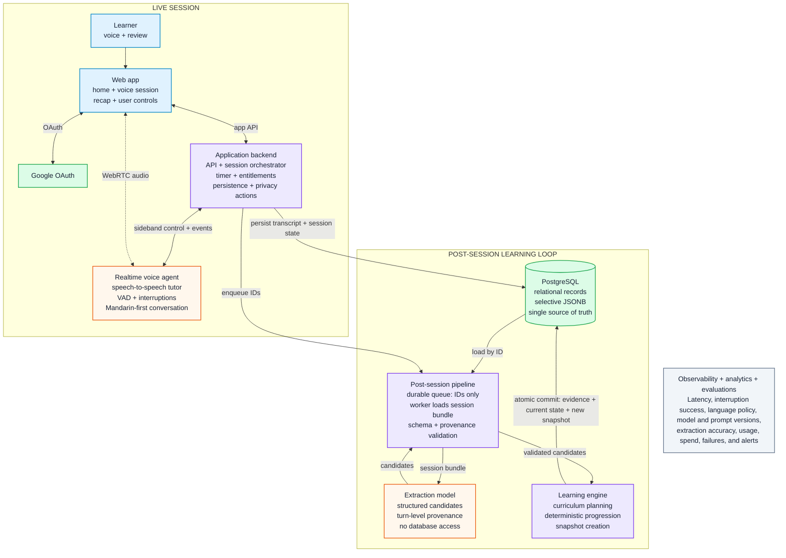

# Mori high-level system design

Live voice stays low latency. Learning updates stay durable, validated, and server controlled.

```mermaid
flowchart TB
    subgraph LIVE["LIVE SESSION"]
        direction LR

        LEARNER["Learner<br/>voice + review"]
        WEB["Web app<br/>home + voice session<br/>recap + user controls"]
        AUTH["Google OAuth"]
        BACKEND["Application backend<br/>API + session orchestrator<br/>timer + entitlements<br/>persistence + privacy actions"]
        VOICE["Realtime voice agent<br/>speech-to-speech tutor<br/>VAD + interruptions<br/>Mandarin-first conversation"]

        LEARNER --> WEB
        WEB <-->|OAuth| AUTH
        WEB <-->|app API| BACKEND
        BACKEND <-->|sideband control + events| VOICE
        WEB <-. WebRTC audio .-> VOICE
    end

    subgraph POST["POST-SESSION LEARNING LOOP"]
        direction LR

        DB[("PostgreSQL<br/>relational records<br/>selective JSONB<br/>single source of truth")]
        PIPELINE["Post-session pipeline<br/>durable queue: IDs only<br/>worker loads session bundle<br/>schema + provenance validation"]
        EXTRACTOR["Extraction model<br/>structured candidates<br/>turn-level provenance<br/>no database access"]
        ENGINE["Learning engine<br/>curriculum planning<br/>deterministic progression<br/>snapshot creation"]

        DB -->|load by ID| PIPELINE
        PIPELINE -->|session bundle| EXTRACTOR
        EXTRACTOR -->|candidates| PIPELINE
        PIPELINE -->|validated candidates| ENGINE
        ENGINE -->|atomic commit: evidence + current state + new snapshot| DB
    end

    BACKEND -->|persist transcript + session state| DB
    BACKEND -->|enqueue IDs| PIPELINE

    OBS["Observability + analytics + evaluations<br/>Latency, interruption success, language policy, model and prompt versions,<br/>extraction accuracy, usage, spend, failures, and alerts"]
    POST ~~~ OBS

    classDef client fill:#e0f2fe,stroke:#0284c7,color:#172033,stroke-width:1.5px
    classDef trusted fill:#ede9fe,stroke:#7c3aed,color:#172033,stroke-width:1.5px
    classDef managed fill:#dcfce7,stroke:#16a34a,color:#172033,stroke-width:1.5px
    classDef external fill:#fff7ed,stroke:#ea580c,color:#172033,stroke-width:1.5px
    classDef observability fill:#f1f5f9,stroke:#64748b,color:#172033,stroke-width:1.5px

    class LEARNER,WEB client
    class BACKEND,PIPELINE,ENGINE trusted
    class AUTH,DB managed
    class VOICE,EXTRACTOR external
    class OBS observability
```
