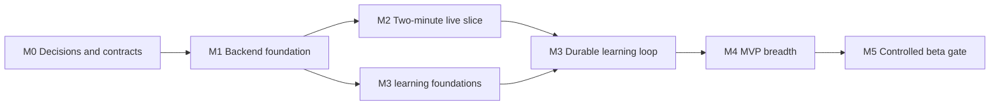

# Backend implementation plan

**Status:** Ready for milestone planning

**Sequence:** M0 through M5, with no calendar estimate implied

This plan delivers one real, recoverable conversation loop before broadening the MVP. Each milestone ends in an observable product outcome and a correctness gate. Work is split by bounded behavior, not by frontend versus backend.

## Outcome

At completion, an adult learner can sign in, receive the correct entitlement, start and safely end a server-controlled voice session, receive a validated recap and updated learner snapshot, inspect or delete retained information, and use the paid Basic allowance. The system is ready for a controlled beta only after failure, privacy, quality, recovery, and operations gates pass.

## Delivery principles

- Build the thinnest end-to-end path before adding breadth.
- Put state machines, transaction boundaries, idempotency, and version pins in place before provider integration grows.
- Deliver frontend adapters and browser behavior with the backend capability they consume.
- Use recorded provider events and pinned transcript bundles so realtime and learning work can proceed independently after the foundation.
- Keep migrations ordered under one owner and review shared contract changes across work lanes.
- Do not enable a policy-sensitive feature until its remaining owner decisions and verification thresholds are approved.

## Dependency map

M2 and the learning foundations of M3 can proceed in parallel after M1. Full M3 integration depends on durable turns and final session watermarks from M2.

## M0: Decision and contract freeze

**Objective:** Turn the approved architecture into reviewable contracts before implementation creates schema or provider lock-in.

Deliverables:

- Reconcile [architecture decisions](../architecture/decisions.md) with the PRD and record any change.
- Define the success and failure transitions for sessions, reservations, analysis runs, audio assets, privacy jobs, and subscription projections.
- Produce the initial ERD with keys, ownership, constraints, deduplication keys, indexes, retention fields, and deletion behavior.
- Define transaction boundaries for session creation, activation, finalization, analysis commit, billing events, and privacy jobs.
- Specify `/api/v1` request and response schemas, the common error envelope, authorization cases, pagination, optimistic concurrency, and idempotency replay behavior.
- Define normalized OpenAI Realtime event envelopes and pinned analysis bundle schemas.
- Define version identifiers for curriculum, planning rules, prompts, models, extraction schemas, analyzers, progression rules, consent policies, and retention policies.
- Decide which open values block M1 through M3. Audio-specific values may remain gated until M4.
- Establish architecture tests and generated-contract drift checks.

Verification:

- Walk through duplicate create requests, concurrent last-grant reservation, successful SDP followed by API failure, supervisor crash, repeated provider events, worker retry, out-of-order Stripe webhook, and session deletion.
- Confirm every scenario has one authoritative state and a bounded recovery path.
- Review the ERD and OpenAPI draft against the existing `WebAppGateway` and `RealtimeSessionFactory` ports.

**Exit gate:** Initial migrations, state machines, event contracts, and API contracts are reviewed and internally consistent.

## M1: Backend foundation

**Objective:** Replace the mock identity and dashboard boundary with a real authenticated read path.

Deliverables:

- Scaffold `apps/backend` as a Python 3.13 uv project using the target module layout.
- Add the FastAPI application factory, Pydantic settings, middleware, structured logging, health, and readiness.
- Add PostgreSQL, SQLAlchemy 2.0, psycopg 3, Alembic, local container configuration, and Testcontainers support.
- Create identity, language profile, preference, plan version, grant, and application-session foundations.
- Integrate Authlib Google OIDC with PKCE, state, nonce, callback allowlisting, and secure database-backed sessions.
- Provision the user, default Mandarin language profile, and one intro grant idempotently after valid sign-in.
- Implement `GET /api/v1/me`, preference mutation, and `GET /api/v1/dashboard` against real read models.
- Export OpenAPI and generate `packages/api-client` with TypeScript types and Zod validators.
- Implement the production `WebAppGateway` and preserve the mock gateway for isolated frontend development and tests.
- Add CI for Python linting, type checks, unit and PostgreSQL integration tests, migrations, web tests, and contract drift.

Verification:

- A new user can sign in, reload with the application session, and see a real dashboard.
- Replaying the callback or provisioning command does not create duplicate users, profiles, sessions, or intro grants.
- Invalid origin, CSRF, state, nonce, and expired application session cases fail safely.
- Migrations apply from an empty database and upgrade from every supported prior migration fixture.

**Exit gate:** An authenticated learner sees the real dashboard through the generated client.

## M2: Two-minute live slice

**Objective:** Prove one real voice session can start, produce durable turns, and end safely under server control.

Use a temporary two-minute cap in non-production environments to accelerate testing. The domain policy remains configurable and the production target remains 20 minutes.

Deliverables:

- Implement intro-grant reservation, consumption, release, expiry, and idempotent session creation.
- Persist a deterministic placeholder session plan with pinned versions.
- Implement the session state machine and connection segments.
- Add the SDP proxy endpoint and OpenAI Realtime adapter.
- Persist provider call ID and absolute server deadline before activation is complete.
- Build the asyncio supervisor, PostgreSQL wake-up and recovery scan, renewable leases, and graceful shutdown.
- Normalize and deduplicate sideband events and persist ordered transcript turns.
- Enforce warning, ending, provider hangup, final watermark, and connected-time rules.
- Implement learner end, disconnect, and basic recovery status in the web realtime adapter.
- Atomically consume the grant after one usable learner turn or release it after setup failure.

Verification:

- One learner completes a real two-minute browser voice session and durable ordered turns remain after refresh.
- Two concurrent start requests cannot consume the same last grant.
- Duplicate browser, provider, and hangup events are harmless.
- Killing the owning supervisor causes lease takeover and the replacement still enforces the deadline.
- Closing the browser does not bypass the cap or strand the entitlement reservation.

**Exit gate:** One real voice session reaches a correct terminal state and ends safely after supervisor process loss.

## M3: Durable learning loop

**Objective:** Turn a finalized transcript into validated evidence, deterministic learner state, and a queryable recap exactly once.

Deliverables:

- Add Procrastinate behind the queue port and insert the analysis job in the finalization transaction.
- Define immutable session bundle and strict extraction candidate schemas.
- Implement the OpenAI Responses extraction adapter with model, prompt, schema, and analyzer version capture.
- Validate candidate schema, exact turn provenance, confidence, allowed memory, and curriculum references.
- Implement pure deterministic evidence, progression, item-state, and level-assessment rules for the initial curriculum slice.
- Atomically commit evidence, item state, assessment, recap, memories, conversation hooks, snapshot, and analysis run status.
- Implement recap processing, success, and failure responses through the generated client.
- Add repair and replay commands that preserve historical runs.
- Create a pinned transcript fixture corpus for success, ambiguity, invalid provenance, language-policy behavior, and provider failure.

Verification:

- Session finalization cannot commit without its job, and a job cannot appear without the corresponding state.
- Retrying a job does not duplicate evidence, memories, recaps, or snapshots.
- Unknown or fabricated turn references cannot enter learning state.
- Replaying the same bundle and versions returns the same deterministic domain decisions.
- The recap becomes queryable within the PRD's 60-second target under the agreed beta load profile.

**Exit gate:** The session-to-recap flow survives retries and replay while preserving provenance and deterministic state.

## M4: MVP breadth

**Objective:** Complete all P0 product paths on the proven foundation.

Deliverables:

- Publish the initial versioned curriculum graph, prerequisites, evidence rules, placement, and promotion gates.
- Replace placeholder planning with deterministic objective selection and immutable session plans.
- Complete reconnect behavior using persisted connected segments and the server timer.
- Add Basic weekly windows, two-session allowance, access decisions, and daylight saving transition coverage.
- Integrate Stripe checkout and signed lifecycle webhooks with an internal plan projection.
- Resolve audio retention and evaluator threshold decisions before starting the retained-audio path.
- Add explicit audio consent, learner-microphone capture, bounded multipart uploads, private SSE-KMS storage, analysis gating, and lifecycle deletion.
- Add memory inspection and idempotent deletion.
- Implement 90-day transcript expiry and cascade-and-rebuild session deletion.
- Implement private export generation and account erasure with auditable job status.
- Add feedback, safety report, snapshot review, audit, and repair records.
- Complete onboarding, history, plan status, recap, privacy, billing, and error states in the web application.

Verification:

- Entitlement property tests cover concurrent reservations, release, consumption, expiry, intro uniqueness, and DST boundaries.
- Webhook tests cover signatures, duplicates, out-of-order events, and the approved failed-payment and cancellation policy.
- Audio tests prove consent-first capture, scope limits, revocation, insufficient-evidence fallback, expiry, and confirmed deletion.
- Session deletion removes all scoped artifacts and produces a correct rebuilt snapshot from remaining evidence.
- Account deletion blocks new sessions immediately and completes across PostgreSQL and object storage.

**Exit gate:** Every P0 PRD path is integrated and has failure-path coverage.

## M5: Controlled beta gate

**Objective:** Demonstrate that the integrated system is safe, recoverable, observable, and educationally credible at the initial beta scale.

Deliverables:

- Run HTTP, active-call, database-lock, queue, and provider-rate-limit load tests against the agreed beta profile.
- Run Mandarin language-policy, extraction, provenance, progression, pronunciation, safety, and memory evaluations across all six levels.
- Complete the threat model and remediate all release-blocking findings.
- Configure structured logs, traces, metrics, dashboards, alerts, redaction, and budget monitoring.
- Write and exercise runbooks for provider outage, supervisor churn, queue backlog, stuck privacy job, billing mismatch, data repair, and secret rotation.
- Configure automated encrypted backups and prove a restore into an isolated environment.
- Exercise deploy rollback and forward-fix procedures with migration compatibility.
- Launch the retrospective snapshot-review workflow with sampling rules and append-only corrections.
- Review retention, consent language, deletion evidence, export content, and data-region choice.
- Execute all PRD acceptance criteria and record evidence.

Verification:

- No open P0 defect, unresolved release-blocking threat, or unowned critical alert remains.
- Restore, supervisor takeover, analysis replay, privacy deletion, and rollback exercises meet their recovery objectives.
- Quality evaluations meet approved thresholds and can be reproduced from versioned fixtures and configurations.
- Telemetry inspection confirms prohibited content is absent.

**Exit gate:** PRD acceptance criteria and the operational readiness review pass for a controlled adult beta.

## Work lanes

### Lane A: Identity and access

Owns authentication, user provisioning, preferences, entitlement resolution, usage ledger, Stripe integration, export authorization, and account lifecycle.

This lane owns short transactional entry points and adversarial concurrency tests. It delivers the relevant frontend gateway methods and browser flows with each capability.

### Lane B: Live session

Owns the session state machine, planning orchestration, SDP adapter, supervisor, sideband normalization, turn ingestion, reconnect, cap enforcement, consented browser capture, and realtime web adapter.

This lane owns latency and provider lifecycle. It publishes recorded normalized event fixtures so Lane C does not depend on live calls during development.

### Lane C: Learning loop

Owns curriculum, objective selection, worker tasks, extraction schema, candidate validation, progression, snapshots, recap, memories, review, and the evaluation corpus.

This lane owns learning correctness. It publishes pinned session bundles and expected deterministic decisions for replay tests.

## Coordination rules

- One named migration owner orders shared schema changes and prevents parallel migration-head drift.
- Any shared OpenAPI or event-envelope change requires review from each consuming lane.
- Each lane owns its application behavior, frontend adapter surface, observability, failure handling, and integration tests.
- Lane B and Lane C integrate through versioned normalized events and session bundles, not provider SDK objects.
- Cross-lane writes go through application commands and shared units of work, never direct table access from transport code.
- A milestone is not complete when only the happy path works. Its stated concurrency, replay, restart, and privacy checks are part of the exit gate.

## Owner setup checklist

### Local development

- Install Python 3.13 and uv.
- Keep Node 22.13 or newer and npm 10 for the existing web application.
- Install Docker Desktop or another Docker-compatible runtime for PostgreSQL and Testcontainers.
- Approve the polyglot monorepo with one uv lockfile and the existing npm lockfile.
- Provide committed seed data for one published curriculum version.

### OpenAI

- Create separate development, staging, and production projects or service accounts.
- Enable Realtime and Responses access, budgets, and rate alerts.
- Select runtime model aliases only after the evaluation baseline passes.
- Approve and provision the privacy-preserving safety ID derivation key.

### Google

- Create the OAuth consent screen for an adult beta.
- Create a Web application OAuth client with exact localhost, staging, and `api.mori` callback URLs.
- Request only basic OpenID profile and email scopes.
- Approve deployed cookie, CORS, trusted-origin, and CSRF configuration.

### Stripe

- Confirm whether the commercial product truly bills weekly before creating recurring prices.
- Create test and live products and map their price IDs to internal immutable plan versions.
- Configure signed webhook endpoints for the approved subscription, invoice, and checkout events.
- Decide tax, refund, failed-payment, cancellation, and grace-period policy.

### AWS production platform

- Create separate staging and production environments, preferably separate accounts.
- Select the primary data region from cohort and legal requirements.
- Provision the documented platform with Terraform.
- Block public bucket access, require SSE-KMS, restrict upload origins, and add lifecycle deletion independently of application jobs.
- Configure automated backups and prove restore before inviting beta users.

### Product and operations

- Provide the first published curriculum graph and promotion rules as versioned source data.
- Create a consented gold transcript and audio evaluation set across all six levels.
- Approve audio consent copy, audio retention, evaluator threshold, and rollback policy.
- Select the OpenTelemetry backend, alert destinations, and incident owner.

Do not commit any secret. Use ignored local configuration and managed secrets in deployed environments.

## Definition of done for every milestone

- Product behavior matches the PRD and the architecture documents, or the governing document is deliberately updated.
- Schema and contract changes include migration, compatibility, and generated-artifact checks.
- Logs, traces, metrics, and alerts expose the new behavior without prohibited sensitive data.
- Unit, property, integration, contract, and browser tests are added in proportion to the boundary's risk.
- Retries, duplicate delivery, concurrency, process restart, timeout, and provider failure have explicit behavior.
- Security and privacy controls are tested at the same boundary where they are enforced.
- Operational repair is possible without editing historical evidence or applying ad hoc database writes.
